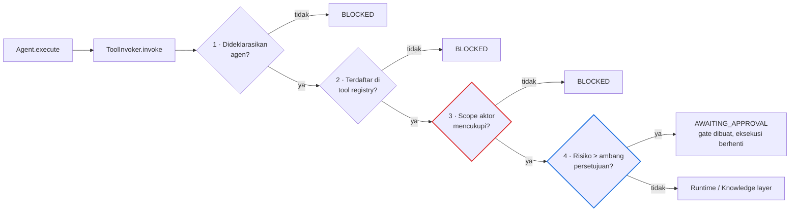

# TANIA — Specialist Agent Architecture

| Item | Keterangan |
|---|---|
| Versi dokumen | **1.1** |
| Tanggal | 19 September 2026 |
| Status | **Terimplementasi** — 9 agen, 299 unit test hijau (38 di antaranya untuk routing dan eksekusi agen) |
| Lingkup | Agent interface, AgentRegistry, AgentRouter, eksekusi lewat tool terkendali |
| Dasar | Prinsip P1, P2, dan P8 pada [`tania-target-architecture.md`](tania-target-architecture.md) |

Dokumen terkait: [`rag.md`](rag.md) · [`foundation.md`](foundation.md)

---

## 1. Batas yang Menentukan Desain

Agen di TANIA **tidak otonom**. Tiga batas dipasang di tipe, bukan di konvensi:

1. **Allow-list tool.** Setiap agen mendeklarasikan `requiredTools`. Tool di luar daftar itu bukan miliknya — ditolak sebelum apa pun berjalan.
2. **Pagu risiko.** `riskLevel` menyatakan batas tertinggi pekerjaan yang boleh dibawa agen.
3. **Tidak ada akses langsung.** Agen tidak pernah memegang referensi ke runtime. Satu-satunya jalan keluar adalah `ToolInvoker`, yang menjalankan registry → policy → approval → runtime dalam urutan tetap.

Konsekuensinya: agen yang "nakal" pun tidak bisa berbuat lebih dari yang diizinkan kebijakan untuk aktor yang memintanya.

---

## 2. Sembilan Agen Spesialis

| Agen | Domain | Pagu risiko | Tool yang diizinkan |
|---|---|---|---|
| `agent.knowledge` | Knowledge Management | `INFORMATIONAL` | `knowledge.search` |
| `agent.research` | Riset & Analisis | `LOW` | `knowledge.search`, `enterprise.data` |
| `agent.product` | Produk & Portofolio | `LOW` | `knowledge.search`, `analytics.query` |
| `agent.solution` | Solusi & Presales | `MEDIUM` | `knowledge.search`, `document.draft` |
| `agent.market-intelligence` | Market & Kompetitor | `LOW` | `knowledge.search`, `enterprise.data` |
| `agent.business-case` | Business Case & Kelayakan | `MEDIUM` | `knowledge.search`, `analytics.query`, `document.draft` |
| `agent.documentation` | Dokumentasi | `MEDIUM` | `knowledge.search`, `document.draft` |
| `agent.performance` | Kinerja & Delivery | `LOW` | `enterprise.data`, `knowledge.search`, `analytics.query` |
| `agent.automation` | Otomatisasi Proses | `HIGH` | `knowledge.search`, `workflow.execute` |

`agent.automation` adalah satu-satunya agen yang membawa pekerjaan `HIGH`, dan karena itu satu-satunya yang rencananya melewati gerbang persetujuan manusia — lihat [`orchestrator.md`](orchestrator.md). Tanpa agen ini, model risiko L3/L4 tidak akan pernah terpanggil di luar pengujian.

Setiap agen mendeklarasikan **kapabilitas**: label, intent yang dijawab, kosakata yang merutekannya, dan tahap kapabilitas (`KNOW`, `REASON`, `CREATE`, …).

---

## 2b. Isolasi Agen — Ditegakkan, Bukan Diamati

Tiga batas pada §1 dijaga tes perilaku di `agent-execution`: tool di luar
allow-list ditolak, aksi L3/L4 berhenti di gerbang persetujuan, dan tiap agen
memverifikasi jalannya sendiri.

Semuanya menguji agen yang **memang** melewati `ToolInvoker`. Tidak satu pun
akan menyadari agen baru yang cukup mengimpor composition root dan memanggil
runtime sendiri: ia tidak pernah menyentuh invoker, jadi tidak ada allow-list,
tidak ada policy, tidak ada gerbang persetujuan — dan seluruh suite tetap hijau,
karena yang diujinya adalah agen-agen lain.

`agent-isolation.test.ts` menutup celah itu dengan memeriksa hal yang tidak bisa
diperiksa perilaku: **apa yang sanggup dijangkau sebuah agen.**

| Aturan | Gagal bila |
|---|---|
| Daftar impor tertutup | Sebuah agen mengimpor apa pun di luar `@tania/types`, `@tania/core/*`, dan `../base/base-agent` |
| Tidak menjangkau runtime | Impor apa pun yang cocok `container`, `runtime/`, `jarvis`, `tools/registry`, `approvals/`, atau `node:` |
| Roster lengkap | Salah satu dari delapan agen spesialis tidak terdaftar |
| Setiap agen terdaftar punya berkas | Jumlah implementasi tidak sama dengan jumlah yang teregistrasi |

Agen yang tidak mengimpor apa pun selain kontraknya **tidak dapat** melewati
Governance Plane, apa pun isi `execute`-nya. Itu properti struktural, bukan
disiplin penulis.

> **Dibuktikan menyala.** Sebuah agen "nakal" yang mengimpor
> `@/lib/tania/container` ditanam sementara: tiga tes gagal, masing-masing
> menyebut berkas dan alasannya — *"the composition root would hand it the live
> runtime"*. Hijau kembali setelah dicabut.
>
> Pemindainya juga diuji terhadap dirinya sendiri: `automation-agent`
> menjelaskan JARVIS dalam prosa, dan sebuah pemindai yang menghitung komentar
> akan menggagalkan berkas karena mendokumentasikan dirinya. Satu tes menahan
> perbedaan itu.

---

## 3. Antarmuka

```ts
interface Agent {
  id: string;
  name: string;
  description: string;
  capabilities: AgentCapability[];
  requiredTools: string[];        // allow-list
  riskLevel: RiskLevel;           // pagu
  execute(task: AgentTask, tools: ToolInvoker): Promise<AgentExecution>;
  verify(execution: AgentExecution): Promise<AgentVerification>;
}
```

`BaseAgent` menyediakan loop eksekusi yang sama untuk semua agen: jalankan setiap langkah lewat invoker, catat trace, dan **berhenti** begitu langkah wajib diblokir atau tertahan di approval gate. Subclass hanya mendeklarasikan langkah dan cara meringkas hasil.

`verify()` adalah pemeriksaan mandiri sebelum hasil ditampilkan — menangkap pemakaian tool di luar deklarasi, klaim selesai tanpa pekerjaan, dan jawaban berbasis pengetahuan tanpa satu pun sitasi.

---

## 4. Eksekusi: Empat Gerbang Berurutan



Retrieval (`knowledge.search`) dilayani lapisan knowledge, bukan runtime: ia membaca indeks yang sudah tersaring untuk aktor tersebut.

---

## 5. Routing

`KeywordAgentRouter` memberi skor pada setiap agen yang layak (`ACTIVE`/`BETA`):

| Sinyal | Bobot | Alasan |
|---|---|---|
| Kosakata kapabilitas yang cocok | 0,60 | Bukti bahwa permintaan memakai bahasa domain agen |
| Kecocokan intent | 0,25 | Agen harus punya kapabilitas untuk intent tersebut |
| Ketersediaan tool bagi aktor | 0,15 | Agen yang toolnya terkunci tidak banyak membantu |

Dua aturan yang membuat keputusannya dapat dipertanggungjawabkan:

- **Tanpa kecocokan kosakata, tidak ada spesialis.** Intent dan ketersediaan tool saja akan melempar pekerjaan ke agen yang tidak ada urusannya, dan alasannya tidak bisa dijelaskan.
- **Fallback bersifat read-only.** Bila tidak ada yang cocok, `agent.knowledge` yang menangani: `INFORMATIONAL`, hanya membaca dokumen, dan selalu menyertakan sitasi.

### Contoh yang diminta

```
Pengguna : "Analisa performance product X."
Intent   : ANALYZE
Agen     : Performance Agent (agent.performance, risiko LOW)
Keyakinan: 0,80 — kata kunci "performance", "analisa" dan intent ANALYZE
Tool     : enterprise.data · knowledge.search · analytics.query
Runner-up: Product Agent (0,60), Business Case Agent (0,40)
```

Diverifikasi oleh tes dan oleh `POST /api/tania/agents/routing`.

---

## 6. API

| Endpoint | Method | Fungsi |
|---|---|---|
| `/api/tania/agents` | GET | Registry apa adanya: kapabilitas, tool, pagu risiko |
| `/api/tania/agents/routing` | POST | Menjelaskan routing tanpa menjalankan apa pun |

Pada percakapan, `POST /api/tania/chat` mengembalikan atribusi agen di `status.agent`: nama, domain, alasan pemilihan, keyakinan, dan tool yang boleh dipakai. UI menampilkannya di atas jawaban.

---

## 7. Pengujian

| Berkas | Isi |
|---|---|
| `tests/agent-routing.test.ts` | 25 kasus: contoh yang diminta, pemilihan per domain untuk kedelapan agen, fallback, penyempitan tool, determinisme, pencocokan kata |
| `tests/agent-execution.test.ts` | 11 kasus: eksekusi penuh, tool tak dideklarasikan, tool tak terdaftar, scope kurang, approval gate menghentikan eksekusi, langkah opsional, dan empat kasus `verify()` |

Tes yang paling penting bukan yang membuktikan routing benar, melainkan yang membuktikan **runtime tidak pernah dipanggil** ketika salah satu gerbang menolak — itulah yang membuat "agen tidak otonom" menjadi properti, bukan niat.

---

## 8. Batasan Saat Ini

1. **Agen belum menjalankan jawaban percakapan.** Routing sudah berjalan dan teratribusi, tetapi jawaban masih disusun Brain dengan rencana tool per intent. Menjadikan agen sebagai perencana adalah langkah berikutnya; pipeline saat ini sengaja tidak diguncang karena sudah teruji.
2. **`enterprise.data` dan `document.draft` dilayani runtime simulasi.** Kontraknya nyata, eksekusinya belum.
3. **Routing berbasis kosakata.** Deterministik dan dapat dijelaskan, tetapi tidak memahami parafrase di luar glosarium dwibahasa pada lapisan pengetahuan.
4. **Belum ada orkestrasi multi-agen.** Satu permintaan → satu agen. Port `Orchestrator` sudah tersedia untuk rantai langkah, retry, dan kompensasi.

---

## 9. Langkah Lanjutan

1. Jadikan routing sebagai perencana: `ExecutionPlan` disusun dari `requiredTools` agen, menggantikan `TOOL_PLAN` tetap di Brain.
2. Implementasikan `Orchestrator` untuk rantai multi-agen dengan state langkah dan kompensasi.
3. Ganti runtime simulasi dengan JARVIS nyata di belakang `RuntimeGateway`.
4. Tambahkan telemetri per agen (jumlah eksekusi, tingkat keberhasilan, gate yang dibuka) menggantikan angka contoh di halaman Agents.
