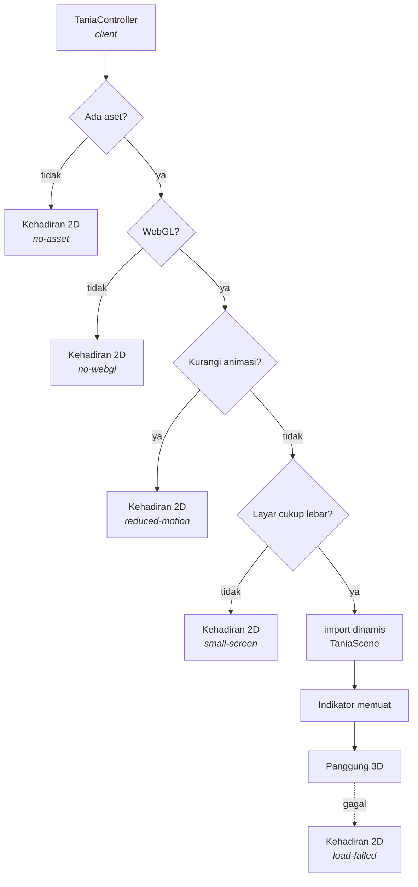

# TANIA — Avatar 3D

| Item | Keterangan |
|---|---|
| Versi dokumen | **1.1** |
| Tanggal | 19 September 2026 |
| Status | **Terimplementasi** — 502 test hijau (88 di antaranya untuk avatar), gerakan dan tatapan diukur dari piksel di peramban |
| Lingkup | `components/tania/*`, `lib/avatar/*`, `TaniaCommand`, lip sync, gerak hidup, dan fallback |
| Dasar | "3D TANIA adalah lapisan antarmuka manusia" pada [`tania-target-architecture.md`](tania-target-architecture.md) |

Dokumen terkait: [`voice.md`](voice.md) · [`orchestrator.md`](orchestrator.md)

---

## 1. Batas yang Menentukan Desain

Avatar menampilkan **apa yang sedang TANIA lakukan**, tidak pernah apa yang sedang ia pikirkan. `TaniaCommand` karena itu hanya memuat penampilan — status, ekspresi, gestur, arah pandang, dan bentuk mulut. Tidak ada penalaran, bukti, atau nama tool yang melewati batas ini.

Batas kedua sama pentingnya: **aplikasi tidak pernah menunggu avatar.** Tidak saat aset diunduh, tidak saat WebGL tidak tersedia, tidak di ponsel, dan tidak ketika aset gagal dimuat.

---

## 2. TaniaCommand

```ts
interface TaniaCommand {
  state: AvatarState;          // IDLE LISTENING THINKING SPEAKING SUCCESS WARNING ERROR
  emotion?: AvatarExpression;  // friendly focused thinking confident cheerful concerned apologetic
  gesture?: AvatarGesture;     // wave explain point nod thinking thumbs-up
  gaze?: AvatarGazeTarget;     // user screen away idle
  speech?: { viseme?: string; amplitude?: number; text?: string };
}
```

Hanya `state` yang wajib. Bidang yang dihilangkan **mempertahankan pose yang sudah ada**, karena sebagian besar perintah hanya mengubah satu hal: jawaban yang mulai mengalir mengubah status, bukan ekspresi. `resolveCommand()` mengisi sisanya dari default yang tersirat oleh status.

| Status | Ekspresi | Gestur | Pandang |
|---|---|---|---|
| `IDLE` | friendly | — | idle |
| `LISTENING` | focused | — | user |
| `THINKING` | thinking | thinking | **away** |
| `SPEAKING` | confident | explain | user |
| `SUCCESS` | cheerful | thumbs-up | user |
| `WARNING` | concerned | — | user |
| `ERROR` | apologetic | — | user |

Dua pilihan yang disengaja: `IDLE` dan `LISTENING` **tanpa gestur**, karena avatar yang terus bergerak saat orang berbicara terbaca tidak sabar, bukan penuh perhatian. Dan `THINKING` memandang **menjauh** — justru itulah yang membuat "sedang berpikir" terbaca dari luar.

---

## 2b. Mengapa Expression, Gesture, Gaze, dan LipSync Bukan Komponen

Brief arsitektur menyebut delapan item di bawah `components/tania/`. Empat ada
sebagai komponen; empat lainnya — expression, gesture, gaze, lip sync — adalah
**kelas pengendali** di `lib/avatar/`, dikomposisikan oleh `TaniaAnimator` di
dalam **satu** `useFrame`.

Itu keputusan, bukan kelalaian:

| Bila dipecah menjadi empat komponen | Akibat |
|---|---|
| Empat `useFrame` terpisah | Urutan tulis bergantung pada urutan anak React, bukan urutan yang dinyatakan |
| Dua penulis pada satu channel | Ekspresi dan lip sync sama-sama menyentuh wajah; hari ini masing-masing memiliki channel sendiri — alis dan kelopak vs mulut — sehingga tidak ada yang menimpa yang lain |
| Komponen yang merender `null` | Ada hanya demi efek samping, pola yang justru dihindari React |
| Biaya per frame berlipat | Satu loop menjadi empat, untuk animasi yang berjalan 60 kali per detik |

Pengendali berupa kelas biasa karena **React tidak perlu me-render rahang**.
Peristiwa bus ditulis ke ref dan dikonsumsi `useFrame`, sehingga mulut yang
bergerak lima kali sedetik tidak berbiaya apa pun di atas kanvas.

> **Kini ditegakkan.** Sifat itu sebelumnya hanya dijaga sebuah komentar.
> `avatar-invariants.test.ts` menggagalkan build bila ada `useFrame` kedua di
> mana pun di aplikasi, bila animator memanggilnya lebih dari sekali, atau bila
> `useState` masuk ke jalur animasi. Dibuktikan menyala dengan menanam komponen
> penulis kedua: tesnya gagal sambil menyebut berkasnya.

Bila bentuk deklaratif tetap diinginkan — `<TaniaExpression value={…} />` di
dalam `<TaniaScene>` — pembungkus tipis di atas pengendali yang sama bisa
ditambahkan tanpa memecah loop. Itu perubahan permukaan, bukan perubahan
arsitektur.


## 3. Komponen

| Komponen | Tanggung jawab |
|---|---|
| `AvatarEventBus` | Satu kanal untuk perintah **dan** peristiwa ucapan |
| `VisemeController` | Bentuk mulut dari timing terbaik yang tersedia |
| `ExpressionController` | Ekspresi, kedipan, dan gerak mikro wajah |
| `GestureController` | Memilih gestur dan merencanakan transisinya |
| `IdleMotion` / `GazeRegistry` | Napas, ayunan kepala, sakade, dan arah pandang bernama |
| `TaniaController` | Memutuskan panggung vs fallback, memuat lazily |
| `TaniaScene` | Canvas R3F dan pencahayaan |
| `TaniaAvatar` | Memuat GLB/VRM, membangun rig, membingkai kamera, membuang sumber daya |
| `TaniaAnimator` | **Satu-satunya** yang menjalankan keempat sistem, di dalam render loop |
| `TaniaStatus` | Lencana status 2D, fallback, dan indikator memuat |

Keempat sistem menulis bagian rig yang **berbeda**, sehingga tidak ada yang menimpa yang lain: ekspresi menulis alis dan kelopak, lip sync menulis mulut, tatapan menulis kepala dan mata, gerak hidup menambahkan drift dan napas.

### Bus, bukan props

Perintah jarang — beberapa kali semenit. Peristiwa ucapan sering — lima kali sedetik. Keduanya berjalan di satu bus tetapi sebagai **jenis peristiwa yang berbeda**, karena perender yang memperlakukannya sama akan merender ulang dirinya terus-menerus. Perintah terakhir diputar ulang ke pelanggan baru; viseme dari dua detik lalu tidak.

### Rig

`AvatarRig` memisahkan komponen dari format. Pencocokan nama blendshape mengabaikan huruf besar dan pemisah — `mouthSmile`, `mouth_smile`, dan `MouthSmile` adalah hal yang sama. Avatar yang wajahnya tidak pernah bergerak karena sebuah garis bawah adalah bug yang sulit dilihat.

### Nama klip animasi

Setiap gestur punya **beberapa** kandidat nama klip, karena eksportir tidak sepakat. Bila tidak ada yang cocok, gestur itu **tidak dimainkan** — melambai saat yang diminta menunjuk lebih buruk daripada diam.

### Pembingkaian kamera

Aset diberikan terpisah dan bisa dibuat pada skala atau titik asal apa pun. Kamera karena itu **diturunkan dari bounding box model itu sendiri**: ambil pita di dekat puncak tempat kepala berada, beri ruang di atasnya, lalu mundur secukupnya.

---

## 3a. Lip Sync

Urutan preferensi, dan `VisemeSource` mencatat mana yang dipakai:

| Sumber | Dari mana | Kualitas |
|---|---|---|
| `engine` | Timeline viseme dari mesin bicara | Terbaik; tidak ada yang diturunkan di atasnya |
| `boundary` | Awal kata yang **diukur** mesin, bentuk dalam kata dari hurufnya | Mendarat di suku kata yang benar |
| `estimated` | Teks saja, pada laju bicara rata-rata | Bentuknya benar, waktunya tidak diukur |
| `amplitude` | Kenyaringan menggerakkan rahang | **Terakhir** — inilah yang membuat avatar tampak seperti pemecah kacang |

Amplitudo sengaja jadi pilihan terakhir, sesuai permintaan. Ia hanya menggerakkan rahang: menebak bentuk mulut dari kenyaringan berarti mengarang.

**Penjangkaran ulang** adalah bagian yang membuat jalur `boundary` bekerja. Setiap kata yang dilaporkan mesin menyetel ulang jam mulut ke waktu kata itu. Tanpa itu, mulut melenceng makin jauh sepanjang jawaban panjang — kegagalan yang membuat lip sync berbasis batas kata terlihat lebih buruk daripada tidak ada sama sekali.

Grafem Indonesia dipetakan ke bentuk mulut dengan cukup baik karena ejaannya nyaris fonemis; itulah yang membuat viseme turunan teks layak dilakukan di sini alih-alih langsung jatuh ke amplitudo. Vokal diberi porsi waktu lebih besar daripada konsonan, karena vokal yang dilihat penonton — mulut yang membagi waktu rata untuk setiap huruf tampak sedang mengunyah.

---

## 3b. Tidak Pernah Beku

| Sistem | Apa yang dilakukan |
|---|---|
| **Kedipan** | Setiap 2,2–7,5 detik, lebih jarang saat mendengarkan. Menutup lebih cepat daripada membuka |
| **Napas** | 14 tarikan/menit saat diam, 19 saat berbicara — orang bernapas lebih cepat ketika berbicara |
| **Ayunan kepala** | Dua gelombang sinus berfrekuensi tak berkelipatan, jadi tidak pernah membentuk pola yang terlihat berulang |
| **Sakade** | Mata melirik sedikit setiap 1–4 detik |
| **Gerak mikro wajah** | Drift alis yang nyaris tak terlihat |

Wajah yang tidak berkedip adalah sinyal paling jelas bahwa sebuah karakter macet, dan itu disadari jauh sebelum orang bisa menjelaskan alasannya.

---

## 4. Tidak Pernah Memblokir



| Persyaratan | Bagaimana dipenuhi |
|---|---|
| **Lazy loading** | `next/dynamic` dengan `ssr: false`. Three.js berada di chunk terpisah (~1 MB) yang **tidak** dirujuk manifest halaman — pengguna ponsel atau yang meminta kurangi animasi tidak pernah mengunduhnya |
| **Fallback** | Kehadiran 2D yang membawa **status yang sama** dan menyatakan alasannya |
| **Indikator memuat** | Ukuran dan bentuknya sama dengan panggung, jadi tidak ada yang bergeser saat avatar tiba |
| **Reduced motion** | Panggung **dimatikan**, bukan diperlambat: permintaannya soal kenyamanan vestibular, dan wajah yang teranimasi terus-menerus persis itulah yang dipersoalkan |
| **Mobile fallback** | Di bawah 768 px, atau `deviceMemory` di bawah 2 GB |
| **Degradasi bertahap** | Antara "tidak bisa" dan "lancar": di bawah 4 GB memori atau 4 core, panggung **tetap berjalan** tanpa gerak hidup dan dengan dpr lebih rendah |

Dievaluasi ulang saat ukuran jendela dan preferensi animasi berubah, sehingga jendela yang diseret ke layar kecil menjatuhkan panggung alih-alih memaksakannya.

Urutan alasan itu penting karena ditampilkan ke pengguna: "peramban tidak mendukung WebGL" adalah saran yang tidak berguna ketika alasan sebenarnya adalah mereka meminta lebih sedikit animasi.

---

## 4a. Performa

| Target | Bagaimana dipenuhi |
|---|---|
| **Menghindari render ulang** | Ucapan tidak pernah mencapai pelanggan perintah. `TaniaController` hanya memanggil `setState` ketika **status** berubah; viseme, amplitudo, dan timing kata masuk ke ref dan dibaca di dalam `useFrame` |
| **Membuang sumber daya WebGL** | Three.js tidak membebaskan buffer atau tekstur saat objek meninggalkan scene. Setiap geometry, material, dan texture dibuang eksplisit saat unmount, mixer dihentikan, dan cache loader dibersihkan |
| **Desktop mulus** | Satu render loop untuk semua sistem; tidak ada environment map (hal paling mahal yang bisa dimuat scene sekecil ini); dpr dibatasi 2 |
| **Mobile bertahap** | dpr 1,5, antialias mati, gerak hidup dilewati |

Satu perlindungan yang mudah terlewat: delta frame **dibatasi 100 ms**. Tab yang kembali dari latar belakang menyerahkan delta raksasa, dan tanpa batas itu avatar akan menyentak melewati setengah detik animasi sekaligus.

---

## 5. Siapa yang Menggerakkan Avatar

```
Lapisan suara ──cue──► VoiceAvatarBridge ──┐
                                            ├──► TaniaCommandBus ──► TaniaController
Workspace ──status──────────────────────────┘
```

Bus, bukan props, karena avatar dan hal-hal yang menggerakkannya berada di bagian pohon yang berbeda — dan panggung dimuat lazily sehingga mungkin belum terpasang. Perintah terakhir **diputar ulang** ke pelanggan baru, jadi avatar yang selesai dimuat di tengah percakapan mengambil pose yang sedang berlaku alih-alih mulai dari `IDLE`.

Dari lapisan suara: `PROCESSING` menjadi `THINKING`, karena itulah yang terlihat dari luar. Ucapan dikurung oleh `speech-start` dan `speech-end`, sehingga pengendali mulut punya jamnya sendiri alih-alih menyimpulkannya dari aliran viseme. Data mulut **tidak pernah** dikirim sebagai perubahan pose.

Perintah juga menerima huruf kecil, jadi contoh yang didokumentasikan bekerja apa adanya:

```json
{ "state": "speaking", "emotion": "confident", "gesture": "explain", "gaze": "dashboard" }
```

`gaze` boleh menyebut region yang didaftarkan antarmuka lewat `GazeRegistry` — memandang hal yang sedang dibicarakan adalah sebagian besar dari yang membuat avatar terasa hadir. Nama yang tidak terdaftar jatuh ke `screen`, bukan menyentakkan kepala ke arah sembarang.

### Region diukur, bukan dipatok

Sudut untuk sebuah region **diturunkan dari posisi elemennya di layar**, bukan dikonfigurasi per nama. Sudut yang dikonfigurasi basi begitu sebuah panel bergeser — dan seluruh nilai dari "memandang sesuatu" adalah bahwa itu benda *itu*, bukan arah yang dulu menjadi tempatnya.

Offset diukur dalam separuh viewport, jadi panel di tepi layar mengklaim sebagian besar jangkauan kepala dan panel tepat di samping avatar nyaris tidak memutarnya. Persegi panjangnya dibaca **saat tatapan diselesaikan**, bukan di-cache: cache basi pada setiap gulir, perubahan ukuran, dan pergantian panel.

Workspace mendaftarkan tiga region dan menandai posisi avatarnya sendiri:

| Region | Kapan dipandang |
|---|---|
| `result` | Jawaban mendarat, atau sebuah gerbang menunggu keputusan |
| `composer` | Menganggur — tempat orangnya akan mengetik berikutnya |
| `conversation` | Terdaftar untuk dipakai berikutnya |

Region yang sudah tidak terpasang atau menyusut ke nol **jatuh ke sudut tetap atau ke default**, tidak membekukan kepala di tempat panel itu dulu berada.

Dari workspace: sibuk → `THINKING`, gerbang menunggu → `WARNING`, kegagalan → `ERROR`, jawaban selesai → `SUCCESS`.

---

## 7. Diverifikasi di Peramban Sungguhan

| Yang diuji | Hasil |
|---|---|
| Tanpa aset | Kehadiran 2D, satu lencana status, alasan "Aset avatar 3D belum dikonfigurasi" |
| Dengan aset | Canvas WebGL ada (408×159), model diminta **satu kali**, panggung merender |
| Lazy loading | Chunk Three.js (~1 MB) tidak ada di manifest halaman |
| Pembingkaian | Kamera diturunkan dari bounds model, bukan dipatok |
| **Tidak beku** | 12 tangkapan layar panel avatar selama 2,6 detik saat diam: **12 bingkai berbeda** |
| **Tatapan region** | Siluet kepala bergeser **0,0315** lebar kanvas antara dua region berseberangan, sementara ayunan idle dalam satu arah hanya **0,0015** — pemisahan 21× |

Fikstur `public/avatar/tania-test.gltf` — sosok kasar dengan `Head`, `Chest`, blendshape `jawOpen`, dan dua klip animasi — ada agar jalur ini dapat dijalankan **dan dilihat** sebelum aset sungguhan tersedia. Ia **bukan** avatar.

> **Catatan pengukuran.** Dua upaya pertama keliru, dan keduanya layak dicatat. Membaca piksel dengan `readPixels` melaporkan "beku": di luar callback render, drawing buffer sudah dibersihkan. Lalu membandingkan hash bingkai untuk menguji tatapan tidak membuktikan apa pun — ayunan idle membuat **setiap** bingkai berbeda. Yang memisahkan keduanya adalah mengukur posisi siluet: ayunan sepersekian derajat, perpalingan puluhan derajat.

---

## 8. Pengujian

| Berkas | Isi |
|---|---|
| `apps/web/tests/avatar-command.test.ts` | 25 test: kontrak perintah, default per status, bus dan pemutaran ulang, **jaminan ucapan tidak memicu render**, jembatan suara, dan keputusan panggung-vs-fallback |
| `apps/web/tests/avatar-rendering.test.ts` | 35 test: bobot ekspresi, peredaman yang tidak bergantung framerate, resolusi nama klip, tatapan bernama, **sudut region dari geometri**, **rantai perintah→sudut**, normalisasi nama rig, dan pembingkaian kamera |
| `apps/web/tests/avatar-motion.test.ts` | 27 test: timing viseme dari teks, preferensi sumber timing, penjangkaran ulang, kedipan, napas, ayunan tanpa pola, transisi gestur, dan **transisi status avatar** |

---

## 9. Batasan yang Diketahui

1. **Aset avatar belum ada.** Semua verifikasi memakai fikstur segitiga. Kualitas rig sungguhan — nama blendshape, nama klip, skala — baru dapat dipastikan setelah aset tiba.
2. **VRM belum diuji.** `@pixiv/three-vrm` terpasang dan `AvatarRig` dirancang untuk menampungnya, tetapi hanya adapter morph-target GLB yang diimplementasikan. VRM `expressionManager` perlu adapter rig kedua.
3. **Timing viseme sungguhan belum tersedia.** Tidak ada mesin bicara yang terhubung melaporkan timeline fonem, jadi jalur `engine` belum pernah dijalankan dengan data nyata — yang berjalan hari ini adalah `boundary` di peramban dan `estimated` di tempat lain.
4. **Tidak ada kontrol kamera.** Pengguna tidak dapat memutar atau memperbesar avatar; pembingkaian otomatis dan tetap.
5. **Gestur belum dipicu per-kalimat.** Gestur mengikuti status, bukan isi jawaban — "point" misalnya tidak pernah terpilih sendiri.
6. **Hanya workspace yang mendaftarkan region.** Dashboard, Knowledge, dan layar lain belum melakukannya, jadi nama seperti `dashboard` masih jatuh ke `screen` di sana.
