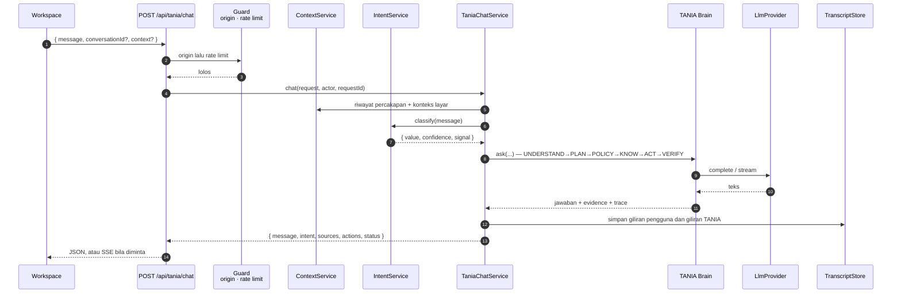

# TANIA — Lapisan Percakapan

| Item | Keterangan |
|---|---|
| Versi dokumen | 1.0 |
| Tanggal | 19 September 2026 |
| Status | **Terimplementasi** — lint, typecheck, 603 unit test, production build hijau, dan **diverifikasi terhadap server produksi yang benar-benar berjalan** |
| Lingkup | `POST /api/tania/chat`, `TaniaChatService`, `IntentService`, `ContextService`, abstraksi `LlmProvider`, klien, persistensi, dan keadaan UI |
| Dasar | Prinsip P7 dan P8 pada [`tania-target-architecture.md`](tania-target-architecture.md) |

Dokumen terkait: [`experience.md`](experience.md) · [`rag.md`](rag.md) · [`agents.md`](agents.md) · [`foundation.md`](foundation.md)

---

## 1. Kontrak

```jsonc
// permintaan
{ "message": "Apa status portofolio produk DPS?",
  "conversationId": "9329fef4-…",          // hilangkan untuk memulai percakapan baru
  "context": { "surface": "/dashboard", "locale": "id-ID" } }

// respons
{ "message": { "id", "conversationId", "role", "content", "createdAt" },
  "intent":  { "value", "confidence", "signal" },
  "sources": [ { "title", "source", "snippet", "classification", "score", "locator", "marker" } ],
  "actions": [ { "id", "type", "label", "risk", "status" } ],
  "status":  { "state", "risk", "trace", "durationMs", "model", "grounded", "confidence" } }
```

Dua bidang tambahan pada permintaan bersifat opsional dan **tidak melewati apa
pun**: `intent` hanyalah petunjuk — layanan tetap mengklasifikasi dan tetap
menerapkan kebijakan — dan `stream` meminta SSE alih-alih satu badan JSON.

### Yang tidak pernah ada di respons

`status.trace` memuat **status eksekusi yang aman**: label tahap, status,
durasi, tool. Tidak ada deliberasi antara. Tidak ada prompt sistem. Tidak ada
chain-of-thought. Itu ditegakkan oleh bentuk tipe `TraceStep` di
`packages/types`, bukan oleh disiplin penulis.

---

## 2. Alur



Urutan guard disengaja: **origin lebih dulu, baru rate limit.** Permintaan
palsu tidak boleh dapat menghabiskan kuota pengguna yang sah.

---

## 3. Tiga Layanan

| Layanan | Tanggung jawab | Tidak boleh |
|---|---|---|
| `TaniaChatService` | Menyusun satu giliran: konteks → intent → Brain → persistensi → respons | Memanggil model langsung; memutuskan kebijakan |
| `IntentService` | Klasifikasi intent lewat `IntentClassifier` yang diinjeksi | Mengubah hasilnya menjadi izin |
| `ContextService` | Riwayat percakapan + konteks layar menjadi konteks bertipe | Menyimpan data sensitif dari layar |

`IntentService` punya dua implementasi: `KeywordIntentClassifier`
(deterministik, gratis, selalu tersedia — bawaan) dan `LlmIntentClassifier`,
yang **jatuh kembali ke keyword pada apa pun yang tak terduga**. Model yang
tidak tersedia tidak boleh menghentikan percakapan.

Intent berkeyakinan rendah **melebarkan rencana; ia tidak pernah melewati
lapisan kebijakan.** Klasifikasi yang salah menghasilkan jawaban yang kurang
tepat, bukan aksi yang tidak diizinkan.

---

## 4. Abstraksi LLM

```
                       @tania/core/reasoning
                          LlmProvider (port)
                                 │
              ┌──────────────────┴──────────────────┐
       MockLlmProvider                       HttpLlmProvider
   deterministik, tanpa jaringan        OpenAI-compatible, ber-timeout
```

`createLlmProvider(config)` adalah **satu-satunya tempat** di portal yang tahu
backend model mana yang dipakai. Ketika `TANIA_LLM_PROVIDER=external` tetapi
`TANIA_LLM_BASE_URL` atau `TANIA_LLM_API_KEY` tidak ada, mock mengambil alih
**dan mencatat alasannya** — portal tetap bisa dipakai, dan tidak ada yang perlu
menebak mengapa jawabannya terasa sintetis.

Tidak ada nama vendor di logika bisnis. Brain, agen, dan orkestrator semuanya
memprogram terhadap port, bukan terhadap penyedia.

---

## 5. Streaming

Tersedia, dan arsitekturnya mendukungnya: `stream: true` atau
`Accept: text/event-stream`.

```
event: accepted → conversationId, dipancarkan sebelum pekerjaan apa pun dilaporkan
event: phase    → UNDERSTANDING · PLANNING · RETRIEVING · EXECUTING · COMPOSING · VERIFYING
event: intent   → klasifikasi segera setelah diketahui
event: sources  → sitasi sebelum teks, agar bukti tampil lebih dulu
event: delta    → potongan jawaban
event: done     → TaniaChatResponse utuh
event: error    → menggantikan semua yang setelah titik gagal
```

> **Cacat yang ditemukan tes route handler.** `accepted` dideklarasikan di
> kontrak, disalurkan lewat `TaniaChatClient`, dan ditangani `workspace.tsx`
> (`setConversationId`) — tetapi `chat()` **tidak pernah memanggil hook-nya**,
> sehingga peristiwa itu tidak pernah sampai. UI tidak terlihat rusak karena ia
> menyetel ulang id dari `done`; yang hilang adalah kemampuan pulih ketika
> aliran **terputus di tengah**: tanpa `accepted`, giliran berikutnya diam-diam
> membuka percakapan kedua. Kini dipancarkan tepat setelah percakapan diketahui.
>
> `messageId` pada peristiwa ini **sengaja tidak ada**: pada saat itu giliran
> sudah punya percakapan tetapi belum punya jawaban, dan mengarang id yang tidak
> cocok dengan `message.id` akhir akan lebih menyesatkan daripada menghilangkannya.

Pipeline, pemeriksaan tata kelola, dan persistensinya **sama persis** dengan
jalur non-streaming. Streaming mengubah pengiriman, bukan keputusan.

`TaniaChatClient` memakai `fetch` + reader, bukan `EventSource`, karena
gilirannya adalah `POST`; `AbortSignal` membatalkan giliran yang sedang berjalan.

---

## 6. Percakapan dan Persistensi

| Model | Bentuk | Penyimpanan |
|---|---|---|
| Conversation | `conversationId` + judul + waktu aktivitas | `TranscriptStore` |
| Message | `{ id, conversationId, role, content, createdAt }` | idem |

Dua implementasi di balik satu antarmuka: `HttpTranscriptStore` (PostgreSQL
lewat `apps/api`) ketika `TANIA_API_BASE_URL` disetel, dan
`InMemoryTranscriptStore` ketika tidak. Halaman Settings menyatakan mana yang
aktif dan apakah ia durabel — mode in-memory tidak pernah menyamar sebagai
persistensi.

---

## 7. UI

| Kebutuhan | Komponen |
|---|---|
| Pesan pengguna & respons TANIA | `workspace/conversation.tsx` |
| Sitasi sumber | `workspace/evidence-list.tsx` — penanda `[1]`, `[2]` merujuk `sources[].marker` |
| Status eksekusi | `workspace/activity-panel.tsx`, `trace-list.tsx` |
| Retry | `retry()` mengirim ulang pesan terakhir; muncul di `ErrorState` |
| Percakapan baru | `startNewConversation()` |
| Loading | Fase streaming saat tersedia; skeleton dan `busy` bila tidak |
| Error | `ChatFailure` bertipe → `ErrorState` dengan aksi coba lagi |

---

## 8. Diverifikasi di Stack Nyata

Dijalankan terhadap `next build` yang benar-benar berjalan, bukan dari pembacaan kode.

| Yang diuji | Hasil |
|---|---|
| Bentuk respons | `message`, `intent`, `sources`, `actions`, `status` — persis kontrak |
| Sitasi | 3 sumber ber-`marker`, `locator`, `classification`, `score` |
| Streaming | `phase` → `intent` → `sources` → `delta` → `done` |
| Persistensi | Dua giliran pada satu `conversationId` → **4 pesan** tersimpan berurutan |
| Percakapan baru | Permintaan tanpa `conversationId` → id baru dikembalikan |
| Origin peramban | **200** |
| Ingress produksi tersimulasi | **200** |
| `Origin: https://evil.test` | **403** |
| Chain-of-thought | Tidak ada di badan mana pun — hanya status tahap |

Verifikasi langsung inilah yang menemukan **DIPERBAIKI-1** pada
[`security-review.md`](../security-review.md): pemeriksaan origin menolak setiap
permintaan sah di belakang proxy. Membaca kode tidak menemukannya, dan tes unit
pun tidak — keduanya memakai URL yang kebetulan sudah merupakan origin publik.

Sejak itu verifikasi ini **tidak lagi manual**. Dua lapis menggantikannya:

| Lapis | Berkas | Yang dijaga |
|---|---|---|
| Tes route handler | `tests/routes/chat-route.test.ts` (21 tes) | Batas HTTP: origin, validasi, amplop, korelasi, cabang streaming, rate limit, dan larangan chain-of-thought — dengan memanggil `POST` yang sebenarnya |
| Smoke test artefak | `scripts/smoke.mjs` (13 pemeriksaan) | Build produksi yang benar-benar mendengarkan di soket, terikat `0.0.0.0` seperti kontainer |

Keduanya dibuktikan benar-benar menyala: bug origin ditanam ulang sementara, dan
smoke test gagal 5/13 dengan pesan diagnostik yang tepat sementara pemeriksaan
negatifnya tetap lulus — lalu hijau kembali setelah perbaikan dipulihkan.

Tes route handler juga langsung menemukan cacat kedua: peristiwa `accepted`
**tidak pernah dipancarkan**, meskipun dideklarasikan di kontrak, disalurkan
lewat klien, dan ditangani UI. Lihat §5.

---

## 9. Batas yang Diketahui

| Hal | Keadaan |
|---|---|
| LLM | Mock deterministik sampai kredensial disetel. `HttpLlmProvider` siap |
| Identitas | `MockIdentityProvider` — satu aktor berhak penuh |
| Persistensi | Durabel hanya bila `TANIA_API_BASE_URL` disetel; selain itu per-proses |
| Rate limit | Per instans; belum terdistribusi |
| Retrieval | Korpus benih 11 dokumen, indeks in-memory |
