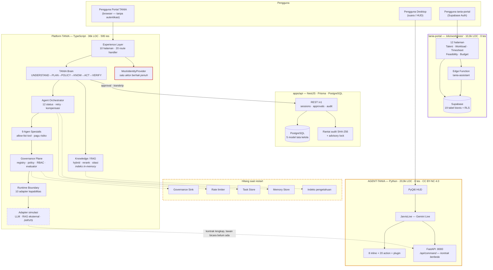

# TANIA — Current State Architecture

| Item | Keterangan |
|---|---|
| Versi dokumen | **2.0** |
| Tanggal audit | 19 September 2026 |
| Lingkup | Seluruh isi direktori `TANIA/`, termasuk `.kilo/worktrees/` |
| Metode | Inspeksi statis penuh + **verifikasi eksekusi** (typecheck, unit, e2e dijalankan di repositori ini) |
| Status | Deskriptif — **tidak ada kode yang diubah** selama audit ini |
| Menggantikan | v1.0 (keadaan pra-fondasi), diarsipkan di [`history/current-state-v1-pra-fondasi.md`](history/current-state-v1-pra-fondasi.md) |

Dokumen terkait: [`tania-target-architecture.md`](tania-target-architecture.md) · [`gap-analysis.md`](gap-analysis.md) · [`foundation.md`](foundation.md)

---

## 1. Ringkasan Eksekutif

Sejak audit v1.0, repositori berubah besar. Monorepo `apps/` + `packages/` sudah berdiri, dan **delapan lapisan arsitektur sasaran sudah terimplementasi dan teruji**: fondasi, RAG, agen spesialis, orkestrator, batas JARVIS, suara, avatar, dan lapisan AI Employee. Semua gerbang verifikasi hijau.

Empat temuan menentukan keadaan hari ini:

1. **Platform TANIA (TypeScript) sudah dalam, bukan kerangka.** 36.091 LOC pada 350 berkas, 576 unit test + 19 e2e hijau, typecheck bersih di lima workspace. Brain, orkestrator tugas, sembilan agen, pipeline RAG permission-aware, sepuluh kapabilitas runtime, gerbang approval durabel, dan rantai audit berhash semuanya nyata.

2. **Lapisan AI-nya masih simulasi.** LLM, retrieval eksternal, JARVIS, identitas portal, dan aset avatar semuanya mock atau fikstur. Arsitekturnya siap menerima yang nyata — port dan adapter sudah ada — tetapi belum satupun tersambung.

3. **Portal PRD ternyata ada, dan tersembunyi.** Basis kode `tania-portal` (Supabase, 10.608 LOC, 11 migrasi, 19 tabel bisnis, repo GitHub sendiri) berada di dalam `.kilo/worktrees/standing-burst/` dalam keadaan *detached HEAD*. Ini menjawab pertanyaan terbuka #3 pada gap analysis v1.0: konflik PRD vs Constitution bukan konflik dokumen, melainkan **dua produk yang sama-sama sudah berjalan**.

4. **Version control justru memburuk.** Akar repositori **bukan repositori git sama sekali**. 36k LOC platform TANIA tidak punya riwayat, review, maupun rollback. Ini sekarang risiko operasional tertinggi di repositori.

---

## 2. Peta Repositori

```
TANIA/                                  ← BUKAN repositori git
├── Claude.md                           Development Constitution (AI Employee)
├── PRD-TANIA.md                        PRD v1.2 (Talent & Analytics)
├── README.md                           Mengikuti PRD, bukan Constitution
├── Dockerfile · docker-compose.yml     Multi-stage; stack lokal berbentuk produksi
├── .github/workflows/ci.yml            4 job: verify · e2e · audit · docker
├── apps/
│   ├── web/                            @tania/web — Portal + Brain + Agen + Orkestrator
│   └── api/                            @tania/api — Persistensi & tata kelola
├── packages/
│   ├── types/                          @tania/types — kontrak wire
│   ├── config/                         @tania/config — env · log · error · health
│   └── tania/                          @tania/core — 14 port domain
├── docs/                               14 dokumen arsitektur & operasi
├── AGENT-TANIA/                        JARVIS Runtime (Python, repo git terpisah)
└── .kilo/worktrees/standing-burst/     tania-portal (Supabase) — repo git terpisah
```

### Volume kode terverifikasi

| Komponen | Bahasa | Berkas | LOC | Tes | Status |
|---|---|---:|---:|---:|---|
| `apps/web` (sumber) | TS/TSX | 220 | 21.797 | — | Build bersih |
| `apps/web` (tes) | TS/TSX | 37 | 7.352 | **483** | Hijau |
| `apps/api` (sumber) | TS | 42 | 2.191 | — | Build bersih |
| `apps/api` (tes) | TS | 1 | 301 | **40 + 19 e2e** | Hijau |
| `packages/types` | TS | 24 | 2.012 | **14** | Hijau |
| `packages/config` | TS | 11 | 865 | **29** | Hijau |
| `packages/tania` | TS | 15 | 1.573 | **10** | Hijau |
| **Subtotal platform TANIA** | **TypeScript** | **350** | **36.091** | **595** | **Hijau** |
| `AGENT-TANIA` | Python 3 | 50 | 20.939 | **0** | Berjalan, tanpa tes |
| `tania-portal` (worktree) | TS/TSX | 41 | 10.608 | **0** | Berjalan, ter-deploy |
| **Total repositori** | — | **441** | **67.638** | **595** | — |

### Gerbang verifikasi (dijalankan 19 September 2026)

| Gerbang | Perintah | Hasil |
|---|---|---|
| Typecheck | `npm run typecheck` | **lolos** — lima workspace |
| Unit & integrasi | `npm run test` | **576 lolos** (config 29 · core 10 · types 14 · api 40 · web 483) |
| E2E backend | `npm run test:e2e` | **19 lolos** — PostgreSQL asli (embedded) |

---

## 3. Inventaris per Kategori

| Kategori | Ada di mana | Keadaan |
|---|---|---|
| **Frontend** | `apps/web` — Next.js 16, React 19, Tailwind v4: **10 halaman**, 20 route handler, ~60 komponen · `AGENT-TANIA/ui.py` (PyQt6 HUD) · `tania-portal` (12 halaman Supabase) | Tiga UI, tiga paradigma — dua di antaranya produk berbeda |
| **Backend** | `apps/api` — NestJS 12, 4 controller (`v1/sessions`, `v1/approvals`, `v1/audit`, `health`), 7 modul · `AGENT-TANIA/dashboard/server.py` (FastAPI) · `tania-portal` Supabase Edge Function | Tiga backend, tujuan berbeda |
| **Database** | PostgreSQL via Prisma 7 — 5 model tata kelola, 1 migrasi · `tania-portal`: Supabase, 11 migrasi, **19 tabel bisnis** + RLS · JARVIS: berkas JSON | Domain tata kelola dan domain bisnis ada di dua database berbeda |
| **Authentication** | `apps/api`: service token + `OidcTokenVerifier` (JWKS, `jose`), diuji · `apps/web`: **`MockIdentityProvider`** — satu aktor berhak penuh · `tania-portal`: Supabase Auth + RLS · JARVIS: passcode + AES-CBC | Portal TANIA **tidak mengautentikasi siapa pun** — pemblokir produksi |
| **AI modules** | `apps/web/src/lib/tania/{brain,llm,intent}` + `lib/knowledge` (pipeline RAG 8 tahap) · `AGENT-TANIA` (Gemini Live, Ollama) · `tania-portal` Edge Function `tania-assistant` | Abstraksi lengkap; implementasi nyata **nol** di platform TANIA |
| **Existing agents** | `apps/web/src/lib/agents` — **9 agen spesialis terimplementasi** dengan `execute`/`verify`, allow-list tool, pagu risiko, dan router | Nyata dan teruji (38 tes routing & eksekusi) |
| **Tools** | `apps/web/src/lib/tania/tools/registry.ts` — **6 tool** ber-`risk`/`effect`/`reversible`/`requiredScopes` · `AGENT-TANIA` 8 inline + 20 action + plugin loader | Dua registry, **belum sinkron** |
| **JARVIS modules** | Sisi TANIA: `runtime/{adapter,client,commands}` + 10 adapter kapabilitas (`HttpCapabilityAdapter` / mock) · Sisi runtime: `AGENT-TANIA/core/*` (11 modul) | Kontrak lengkap di sisi TANIA; **sisi JARVIS belum mengimplementasikannya** |
| **Memory** | `packages/tania/src/memory` (port ber-scope & ber-klasifikasi) + `InMemoryMemoryStore` · `AGENT-TANIA/memory/long_term.json` | Port benar; penyimpanan **hilang saat restart** |
| **Dashboards** | Portal `/dashboard`, `/analytics`, `/command-center` (8 panel dari jejak eksekusi nyata) · JARVIS HUD · JARVIS FastAPI · `tania-portal` Executive Dashboard | Empat dashboard |
| **Tests** | Platform TANIA **595** (termasuk e2e PostgreSQL asli) · Playwright golden-path · AGENT-TANIA **0** · tania-portal **0** | 31,5k LOC tanpa jaring pengaman |
| **Deployment** | Dockerfile multi-stage (non-root, healthcheck, prune dev deps) · `docker-compose.yml` (Postgres 18 + Redis 7) · CI 4 job · **CD belum ada** | Ada dan matang; Redis disediakan tetapi **belum dipakai kode** |

---

## 4. Platform TANIA — Lapisan yang Sudah Berdiri

### 4.1 `packages/` — kontrak dan port

Arah ketergantungan satu arah dan ditegakkan: **aplikasi → port → kontrak**.

- `@tania/types` — 24 berkas kontrak wire: `risk`, `governance`, `runtime`, `task`, `trace`, `evidence`, `classification`, `voice`, `avatar`, `evaluation`.
- `@tania/config` — validasi environment gagal-cepat, logger terstruktur, error terpusat, correlation id, health.
- `@tania/core` — 14 port domain: identity, intent, context, reasoning, planning, memory, knowledge, orchestration, governance, verification, runtime, voice, insight.

### 4.2 `apps/web` — Experience, Brain, Agen, Orkestrator

| Lapisan | Wujud | Catatan |
|---|---|---|
| Experience | 10 halaman, 20 route handler, error/loading boundary per rute | Command Center menghitung 8 panel dari jejak eksekusi nyata |
| Brain | `TaniaBrain` — UNDERSTAND → PLAN → POLICY → KNOW → ACT → VERIFY → AUDIT | Tidak pernah mengekspos chain-of-thought |
| Knowledge | store → ingestion → chunking → embedding → hybrid retrieval → reranking → sitasi → grounding policy | Filter izin **sebelum** skoring; indeks **in-memory** |
| Agents | 9 agen + `AgentRouter` + `GovernedToolInvoker` | Agen tidak pernah memegang referensi runtime |
| Orchestration | `Orchestrator`, `Planner`, `ExecutionManager`, `VerificationManager`, `ApprovalManager`, `TaskStore`, `MemoryStore` | Siklus hidup 12 status dengan tabel transisi tertutup |
| Runtime boundary | `CapabilityRoutingAdapter` + 10 adapter kapabilitas | Kapabilitas tak-terkonfigurasi **dilaporkan** `live: false`, bukan dikarang |
| Governance | tool registry, policy engine, RBAC, rate limit, request guard, evaluator 8 metrik, recorder | Sink audit **in-memory** |
| Voice & Avatar | state machine 5 status, adapter STT/TTS (browser/JARVIS/mock), `TaniaCommand` 7 status, viseme lip sync | Aset avatar hanya `tania-test.gltf` (2,4 KB) |

Composition root tunggal di `container.ts`: setiap dependensi dikonstruksi sekali dan diinjeksikan, sehingga adapter nyata dapat menggantikan mock tanpa menyentuh Brain.

### 4.3 `apps/api` — Persistensi & Tata Kelola

- Model: `Actor`, `Session`, `Message`, `Approval`, `AuditEvent`.
- **Audit berantai hash**: `prevHash` + `hash` (SHA-256 atas JSON kanonik), append diserialisasi `pg_advisory_xact_lock`, `GET /v1/audit/verify` merekomputasi seluruh rantai. `AuditEvent` sengaja tanpa foreign key agar cascade tidak pernah menulis ulang baris audit.
- **Approval state machine**: update bersyarat `status = PENDING` (dua approver bersamaan → `409`), cek scope `workflow:approve`, separation of duty opsional.
- **Auth**: `AUTH_MODE=service` atau `AUTH_MODE=oidc` (JWKS discovery standar), guard global.

---

## 5. AGENT-TANIA — JARVIS Runtime

**Tidak berubah sejak audit v1.0.** Commit terakhir `2ab2298`; 50 berkas Python, 20.939 LOC, **nol tes**.

| Fakta | Implikasi |
|---|---|
| Tidak ada endpoint `POST /v1/commands` | Kontrak `JarvisCommand` yang sudah lengkap di sisi TANIA **belum punya lawan bicara**. `dashboard/server.py` mengekspos `/api/command` dengan kontrak berbeda |
| `TANIA-LICENSE-NOTICE.md` → CC BY-NC 4.0 | Penggunaan komersial tidak diizinkan — **masih memblokir** jalur runtime |
| `confirm` dipakai 1/28 tool, `push_undo` 2/28 | Tool destruktif lain berjalan tanpa gate maupun undo |
| `config/api_keys.json` plaintext | Kredensial model di disk tanpa proteksi |
| `.kilo/worktrees/metal-tarascosaurus/` (5,6 MB) | Salinan penuh pohon AGENT-TANIA, detached HEAD |
| `tania/` overlay | Masih stub pass-through |

Pola terbaiknya tetap layak diacu: `core/action_loader.py` (tool self-describing, deteksi tabrakan nama, kegagalan import tidak menjatuhkan proses) dan `core/confirm.py` (token dikeluarkan antarmuka, bukan model).

---

## 6. tania-portal — Temuan Baru

Ditemukan di `.kilo/worktrees/standing-burst/`. Repo git tersendiri (`github.com/henriset2026-stack/tania-portal`), **detached HEAD**, commit terakhir `bf141a1`.

| Aspek | Keadaan |
|---|---|
| Identitas | Inilah portal yang dirujuk `PRD-TANIA.md` dan `README.md` sebagai "MVP live (invite-only)" |
| Stack | Next.js 16, React 19, Tailwind v4, `@supabase/supabase-js` — **bukan** stack Constitution |
| Volume | 41 berkas TS/TSX, 10.608 LOC, **nol tes** |
| Data | 11 migrasi Supabase, 19 tabel bisnis: `profiles`, `projects`, `allocations`, `timesheets`, `budget_entries`, `budget_lines`, `cost_rates`, `feasibility_cases`, `skills`, `profile_skills`, `activities`, `announcements`, `audit_log`, `chat_conversations`, `chat_messages`, `development_goals`, `project_issues`, `project_milestones`, `project_risks` |
| Tata kelola | RLS policies, separation of duty pada approval, transition guard timesheet — **ditegakkan di database** |
| AI | Supabase Edge Function `tania-assistant` (tool calling + RAG) |
| Dokumen | Set lengkap BRD/PRD/SRS/SAD/TRD/DDD/UIUX di dalam worktree |
| Deploy | `netlify.toml` hadir; PRD menyebut Vercel |

**Konsekuensi audit.** Domain bisnis PRD bukan "belum ada satu pun entitas" seperti disimpulkan v1.0 — domain itu **sudah terimplementasi lengkap**, hanya di basis kode dan platform data yang berbeda. Keputusan produk yang tertunda kini berbiaya lebih tinggi: bukan memilih apa yang akan dibangun, melainkan memutuskan nasib dua sistem yang sama-sama berjalan.

---

## 7. Konflik Definisi Produk — Diperbarui

| | `tania-portal` (PRD v1.2) | Platform TANIA (Constitution) |
|---|---|---|
| Nama | Talent & Analytics Intelligence Assistant | Telkom AI Native Intelligent Assistant / AI Employee |
| Inti | Talent, workload, timesheet, feasibility, budget | Brain, agen, orkestrator, runtime, tata kelola |
| Stack data | Supabase (Postgres, Auth, RLS, Storage) | PostgreSQL + Prisma + NestJS (+ Redis, belum dipakai) |
| Identitas | Supabase Auth + RLS — **berjalan** | OIDC/Entra ID — verifier siap, portal **masih mock** |
| AI | Edge Function tool calling + RAG | Brain + 9 agen + orkestrator + 10 kapabilitas runtime |
| Model data | 19 tabel bisnis | 5 tabel tata kelola |
| Tes | 0 | 595 |
| Status | Ter-deploy, dipakai | Belum siap produksi (lihat [`production-readiness.md`](../production-readiness.md)) |
| Letak | `.kilo/worktrees/standing-burst/` | `apps/` + `packages/` |

Keduanya konsisten secara internal. Yang satu punya **domain bisnis dan pengguna nyata tanpa tata kelola AI**; yang lain punya **tata kelola AI mendalam tanpa domain bisnis**. Keduanya saling melengkapi secara teknis — dan justru itulah yang membuat keputusan produk mendesak, bukan akademis.

---

## 8. Version Control & Hygiene

| Fakta | Implikasi |
|---|---|
| **`TANIA/` bukan repositori git** (`git rev-parse` gagal sampai batas mount) | 36.091 LOC platform TANIA **tanpa riwayat, review, atau rollback**. Naik dari temuan v1.0 — dulu masih tercakup repo home, kini tidak sama sekali |
| `.gitignore` akar sudah benar dan lengkap | Siap untuk `git init`; tidak ada rahasia yang akan ikut ter-commit |
| `AGENT-TANIA/` repo terpisah, remote sendiri | Tidak ada riwayat bersama |
| `.kilo/worktrees/standing-burst/` repo terpisah, **detached HEAD** | Perubahan di sini tidak berada di branch mana pun — mudah hilang |
| `AGENT-TANIA/.kilo/worktrees/metal-tarascosaurus/` (5,6 MB) | Salinan penuh; risiko menyunting salinan yang salah |
| CI lengkap (`verify`, `e2e`, `audit`, `docker`) | **Tidak pernah berjalan** — tidak ada remote yang memicunya |
| Dockerfile & compose matang | Tidak ada CD; belum ada manajemen rahasia |

CI yang benar tanpa repositori git adalah pipeline yang tidak pernah dieksekusi. Ini bukan utang kecil.

---

## 9. Diagram Keadaan Saat Ini



---

## 10. Ringkasan Temuan

**Yang sudah kuat**

1. **Tata kelola end-to-end.** Policy layer, gerbang approval durabel dengan anti-race, rantai audit terverifikasi, klasifikasi data empat tingkat yang ditegakkan di retrieval, evaluator AI yang menolak melaporkan skor atas sampel di bawah lima.
2. **Batas yang ditegakkan di tipe, bukan konvensi.** Agen tidak bisa memegang runtime; tool di luar allow-list ditolak sebelum apa pun berjalan; transisi status tugas yang tidak ada di tabel melempar error alih-alih diam.
3. **Kejujuran tentang simulasi.** Setiap adapter simulasi melaporkan `live: false`; Settings menampilkan apakah state durabel; metrik tanpa observasi dilaporkan `sample: 0`, bukan di-default ke sempurna. Ini jarang dan berharga.
4. **Fondasi rilis.** Docker multi-stage non-root ber-healthcheck, compose berbentuk produksi, CI empat job, environment tervalidasi gagal-cepat.
5. **Domain bisnis PRD sudah nyata** di `tania-portal`, lengkap dengan RLS dan separation of duty di lapisan database.

**Yang menghambat**

1. **Tidak ada version control** pada 36k LOC — risiko kehilangan kerja, dan CI yang tidak pernah berjalan.
2. **Portal tidak mengautentikasi siapa pun.** Seluruh model RBAC yang sudah dibangun belum pernah dievaluasi terhadap identitas nyata.
3. **Jejak tata kelola, tugas, memori, dan indeks hilang saat restart.**
4. **Lisensi non-komersial** pada runtime — belum diklarifikasi sejak v1.0.
5. **Sisi JARVIS dari kontrak runtime belum ada**; ACT masih simulasi.
6. **Keputusan produk masih tertunda**, dan kini menyangkut dua sistem berjalan, bukan dua dokumen.
7. **31,5k LOC (Python + tania-portal) tanpa satu pun tes.**
