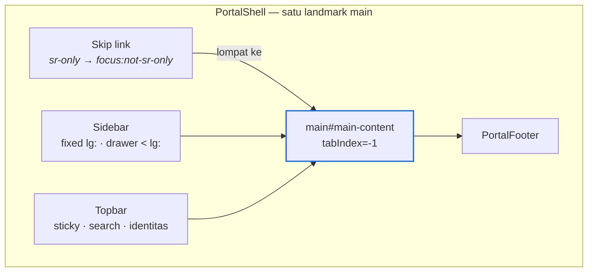

# TANIA — Experience Layer (Portal Frontend)

| Item | Keterangan |
|---|---|
| Versi dokumen | 1.0 |
| Tanggal | 19 September 2026 |
| Status | **Terimplementasi** — lint, typecheck, 597 unit test, dan production build hijau |
| Lingkup | Application shell, sidebar, top navigation, layout responsif, 10 halaman, sistem komponen, dan tiga keadaan UI (loading, empty, error) |
| Dasar | Bagian 7 (UX) pada `Claude.md`; lapisan L1 pada [`tania-target-architecture.md`](tania-target-architecture.md) |

Dokumen terkait: [`ai-employee.md`](ai-employee.md) · [`avatar.md`](avatar.md) · [`voice.md`](voice.md) · [`foundation.md`](foundation.md)

Bukan ruang lingkup dokumen ini: Brain, agen, orkestrator, RAG. Experience Layer
**merender** hasil lapisan-lapisan itu dan tidak pernah memutuskan apa pun
tentang isinya.

---

## 1. Batas Lapisan

Satu aturan yang menentukan seluruh desain di bawah: **halaman tidak mengambil
keputusan domain.** Komponen menerima data bertipe, merendernya, dan mengirim
niat pengguna kembali. Klasifikasi risiko, pemilihan tool, kebijakan, dan
persetujuan semuanya sudah selesai sebelum data sampai ke sini.

Konsekuensi konkretnya:

- Tidak ada komponen yang mengimpor Prisma, memanggil database, atau memegang rahasia.
- Data mock masuk lewat **antarmuka bertipe yang sama** dengan yang nanti diisi sumber nyata — mengganti sumber tidak menyentuh satu pun komponen.
- Semua pemanggilan keluar melewati route handler di `src/app/api/*`, bukan langsung dari komponen klien.

---

## 2. Application Shell



| Bagian | Berkas | Perilaku |
|---|---|---|
| Shell | `components/layout/portal-shell.tsx` | Menyusun sidebar, topbar, `main`, footer; memegang state buka/tutup drawer |
| Sidebar | `components/layout/sidebar.tsx` | `fixed` selebar 60 pada `lg:`, drawer modal di bawahnya |
| Top navigation | `components/layout/topbar.tsx` | Sticky; pencarian global, notifikasi, identitas aktor |
| Footer | `components/layout/portal-footer.tsx` | Konteks unit & versi |

Shell adalah satu-satunya komponen yang memegang state layout. Halaman tidak
tahu bahwa sidebar bisa ditutup.

---

## 3. Navigasi

Model navigasi berada di `src/lib/nav.ts` — **data, bukan JSX** — sehingga
sidebar, top bar, dan tes membaca sumber yang sama.

| Urutan | Destinasi | Isi |
|---|---|---|
| — | Home | Sambutan dan akses cepat |
| 1 | **Dashboard** | Portofolio, inisiatif, KPI, risiko, insight |
| 2 | **My Work** | Tugas, review, persetujuan |
| 3 | **TANIA** | Workspace percakapan |
| 4 | **Knowledge** | Dokumen, kebijakan, template |
| 5 | **Agents** | Agen spesialis per domain |
| 6 | **Documents** | Dokumen kerja dan draf |
| 7 | **Analytics** | Adopsi dan dampak |
| 8 | Command Center | Operasi, mutu, jejak tata kelola |
| — | **Settings** | Disematkan di dasar sidebar |

`Command Center` ditambahkan oleh lapisan AI Employee, bukan bagian dari delapan
destinasi utama. `isActivePath` menandai rute aktif termasuk sub-rutenya;
`currentNavItem` memilih kecocokan terpanjang sehingga `/tania/x` tidak pernah
menandai `/` sebagai aktif.

---

## 4. Layout Responsif (desktop-first)

| Breakpoint | Sidebar | Top bar | Grid dashboard |
|---|---|---|---|
| `< lg` (< 1024px) | Drawer modal, dipanggil tombol hamburger | Pencarian disembunyikan `< md`, identitas diringkas `< sm` | Satu kolom |
| `lg` (≥ 1024px) | Tetap terlihat, konten bergeser `lg:pl-60` | Penuh | Dua kolom pada bagian tertentu |
| `xl` (≥ 1280px) | Sama | Menampilkan judul rute + deskripsi | `xl:grid-cols-[minmax(0,2fr)_minmax(0,1fr)]` |

`minmax(0,…)` dipakai di setiap kolom grid, bukan `1fr` polos: tanpa itu, satu
tabel lebar memaksa kolom melebar dan memunculkan scroll horizontal pada seluruh
halaman.

---

## 5. Dashboard

Enam bagian yang diminta, masing-masing **di balik Suspense-nya sendiri dan
error boundary-nya sendiri**:

| Bagian | Komponen | Fallback |
|---|---|---|
| KPI | `kpi-section.tsx` | `StatCardsSkeleton` |
| Product Portfolio | `portfolio-section.tsx` | `TableSkeleton` |
| TANIA Insights | `insights-section.tsx` | `TableSkeleton` (3 baris) |
| Active Initiatives | `initiatives-section.tsx` | `TableSkeleton` (5 baris) |
| Risks | `risks-section.tsx` | `CardsSkeleton` |
| Recent AI Tasks | `recent-tasks-section.tsx` | `CardsSkeleton` |

Alasan granularitas ini satu: **sumber yang lambat atau rusak merusak satu
kartu, bukan seluruh halaman.** Dashboard eksekutif yang kosong total karena
satu panel gagal adalah dashboard yang tidak dipercaya.

`?simulate=empty|error|slow` menjalankan ketiga keadaan terhadap data mock —
keadaan kosong dan gagal dapat dilihat tanpa merusak apa pun.

---

## 6. TANIA Workspace

| Bagian yang diminta | Komponen |
|---|---|
| Conversation area | `workspace/conversation.tsx` |
| Prompt composer | `workspace/prompt-composer.tsx` — Enter kirim, Shift+Enter baris baru |
| Microphone button | `workspace/voice-button.tsx` — terhubung ke `useVoice`, adapter mock bila STT tidak tersedia |
| Quick actions | `workspace/quick-actions.tsx` |
| Execution / activity panel | `workspace/activity-panel.tsx` — jejak eksekusi, bukan chain-of-thought |
| Result panel | `workspace/result-panel.tsx` — hasil, bukti, sitasi |

Panel aktivitas dan hasil berbagi satu `Tabs` di layar sempit dan tampil
berdampingan di `xl:`. Keduanya membaca `TaniaTurn` bertipe; tidak ada satu pun
di antaranya yang memanggil model.

---

## 7. Sistem Komponen

`components/ui/*` — dipakai ulang di seluruh halaman, tanpa pengetahuan domain:

`Button` · `Card` · `Section` · `PageHeader` · `StatCard` · `Tabs` · `Progress` ·
`Badges` · `Skeleton` · `EmptyState` · `ErrorState` · `RouteError` ·
`SectionBoundary` · `TaniaWordmark` · `tone`

`tone.ts` memusatkan pemetaan status/risiko → warna, sehingga `HIGH` tampak sama
di dashboard, workspace, dan My Work tanpa tiga definisi warna yang berbeda.

---

## 8. Tiga Keadaan UI

Ketiganya adalah komponen, bukan kondisi yang ditulis ulang per halaman.

### Loading

| Rute | Fallback |
|---|---|
| Dashboard, My Work, Knowledge, Agents, Settings, TANIA, Documents | `loading.tsx` masing-masing |
| Home, Analytics, Command Center | `(portal)/loading.tsx` — fallback grup yang sengaja netral |
| Command Center | Tambahan `<Suspense>` internal, karena kueri jejaknya jauh lebih lambat dari kerangka halamannya |

Fallback grup sengaja **tidak** berbentuk hero: ia melayani Home sekaligus rute
lain, dan kerangka khas-Home akan terlihat salah di Analytics.

Semua skeleton memakai `LoadingRegion`: `role="status"`, `aria-busy`,
`aria-live="polite"`, satu label `sr-only`, dan kotak berkedip ber-`aria-hidden`.
Pembaca layar mendengar "Memuat portofolio produk" satu kali, bukan dua belas
kotak abu-abu.

### Empty

`EmptyState` dipakai di keenam bagian dashboard, ketiga panel workspace, dan
ketiga komponen My Work. Setiap keadaan kosong menyebut **mengapa** kosong dan
tindakan berikutnya — bukan hanya "Tidak ada data".

### Error

`SectionBoundary` membungkus tiap panel; `error.tsx` menangani kegagalan seluruh
rute; `(portal)/error.tsx` menangkap rute yang tidak punya milik sendiri.
`RouteError` menyediakan tombol coba lagi.

---

## 9. Aksesibilitas

| Hal | Implementasi |
|---|---|
| Skip link | Tautan pertama; `sr-only` sampai difokus, lalu melompat ke `main#main-content` |
| Landmark | Satu `main`, `nav aria-label="Navigasi utama"`, `aria-label="Navigasi samping"`, `role="search"` |
| Rute aktif | `aria-current="page"` |
| Fokus terlihat | `focus-visible:outline-2 outline-offset-2 outline-brand` pada setiap kontrol |
| Ikon | Seluruhnya `aria-hidden`; makna dibawa teks, bukan bentuk |
| Pintasan | `/` memfokuskan pencarian, dan **tidak** membajak ketikan di input, textarea, atau elemen contenteditable |
| Badge angka | Disertai teks `sr-only` (" item perlu perhatian") |

### Drawer navigasi sebagai dialog modal

Drawer mendeklarasikan `aria-modal="true"`. Atribut itu adalah **klaim**, dan
`useModalDrawer` di `sidebar.tsx` menegakkannya:

1. **Fokus masuk ke dialog** saat dibuka — ke elemen dialognya sendiri, agar
   pembaca layar mengumumkan namanya sebelum isinya.
2. **Tab terkurung** di dalam dialog, membungkus maju dan mundur.
3. **Escape menutup.**
4. **Fokus dikembalikan** ke pemicunya saat ditutup — kecuali navigasi sudah
   memindahkannya ke tempat yang lebih berguna.
5. **Backdrop disembunyikan** dari teknologi bantu (`aria-hidden`, `tabIndex=-1`):
   ia hanya afordans tetikus, dan tanpa ini pembaca layar mengumumkan dua kontrol
   "tutup" yang identik.

Tanpa keempat hal pertama, `aria-modal` justru **memperburuk** keadaan: ia
memberi tahu pembaca layar bahwa sisa halaman tidak aktif, padahal Tab masih
berjalan ke sana.

Tujuh tes di `tests/components/sidebar-drawer.test.tsx` menjaga perilaku ini.

---

## 10. Data Mock Lewat Antarmuka Bertipe

```
components  →  lib/portal/services.ts  →  lib/portal/mock/services.ts
                      (antarmuka)              (implementasi mock)
```

Tipe di `lib/portal/types.ts`; fikstur di `lib/portal/mock/fixtures.ts`.
Mengganti mock dengan sumber nyata berarti menulis implementasi kedua dari
antarmuka yang sama dan menukarnya di satu tempat — tidak ada komponen yang
berubah.

Tidak ada AI nyata di lapisan ini: LLM, retrieval, dan runtime semuanya mock,
dan halaman Settings menyatakan mana yang simulasi. Lihat
[`current-state.md`](current-state.md) §10.

---

## 11. Hasil Verifikasi

Dijalankan di repositori ini, bukan dikutip.

| Gerbang | Hasil |
|---|---|
| `npm run lint` | ✅ tanpa peringatan |
| `npm run typecheck` | ✅ lima workspace |
| `npm test` | ✅ **597 tes** — web 490 (termasuk 7 tes drawer baru) |
| `npm run build` | ✅ production build, 10 halaman portal + 20 route handler |

---

## 12. Batas yang Diketahui

| Hal | Keadaan |
|---|---|
| Identitas | `MockIdentityProvider` — portal belum mengautentikasi siapa pun. Tautan identitas di top bar menuju Settings, bukan menu akun |
| Menu akun | Belum ada. Sebelumnya tombol ini mendeklarasikan `aria-haspopup="menu"` tanpa menu mana pun; ARIA palsu itu dicabut, bukan disembunyikan |
| Data KPI, inisiatif, risiko | Fikstur. Dokumen dan riwayat tugas sudah nyata |
| `middleware.ts` | Next 16 menyarankan migrasi ke `proxy`; ditunda karena berkas itu memegang CSP ber-nonce per permintaan |
| i18n | Antarmuka berbahasa Indonesia; belum ada lapisan terjemahan |
| Uji aksesibilitas otomatis | Belum ada axe/pa11y di CI; aksesibilitas saat ini dijaga tes perilaku, bukan pemindai |
