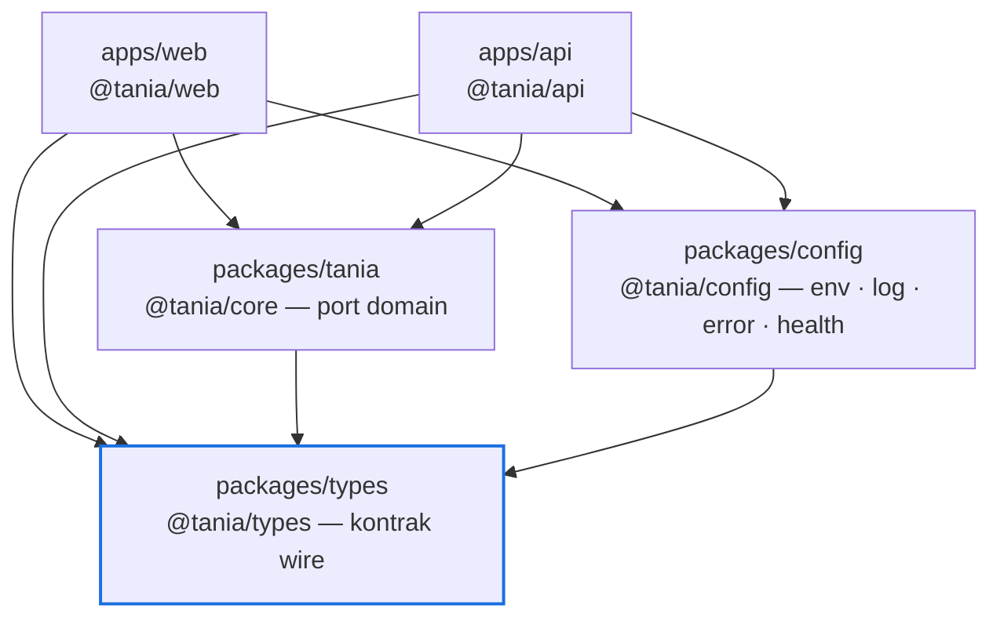

# TANIA — Foundation Architecture

| Item | Keterangan |
|---|---|
| Versi dokumen | 1.0 |
| Tanggal | 19 September 2026 |
| Status | **Terimplementasi** — typecheck, lint, 133 unit test, 19 e2e, dan build produksi hijau |
| Dasar | Fase 1 pada [`gap-analysis.md`](gap-analysis.md) §8 |
| Ruang lingkup | Batas aplikasi, tipe bersama, konfigurasi, konvensi API, error, logging, health, lingkungan pengembangan |

Bukan ruang lingkup dokumen ini: logika AI, orkestrasi agen, RAG nyata, integrasi
JARVIS. Fondasi ini menyiapkan tempatnya, bukan mengisinya.

---

## 1. Struktur Repositori

```
TANIA/
├── apps/
│   ├── web/                  @tania/web — Portal (Next.js 16, React 19)
│   └── api/                  @tania/api — Persistensi & tata kelola (NestJS 12, Prisma 7)
├── packages/
│   ├── types/                @tania/types — kontrak wire
│   ├── config/               @tania/config — primitif runtime platform
│   └── tania/                @tania/core — port domain (10 domain)
├── AGENT-TANIA/              JARVIS Runtime (Python, repo git terpisah)
├── docs/architecture/        Audit, target, gap, dan dokumen ini
└── package.json              npm workspaces + skrip verifikasi
```

Nama paket `@tania/core` menempati folder `packages/tania` sesuai struktur yang
disetujui; import-nya terbaca wajar (`@tania/core/governance`).

### Arah ketergantungan



Aturannya satu arah dan tidak boleh dilanggar: **aplikasi → port → kontrak**.
Paket tidak pernah mengimpor aplikasi, dan `@tania/types` tidak mengimpor apa pun.

Aturan ini **ditegakkan oleh tes**, bukan oleh konvensi:
[`packages/tania/src/boundaries.spec.ts`](../../packages/tania/src/boundaries.spec.ts)
memindai seluruh sumber di `packages/*/src` dan menolak empat hal —

| Aturan | Gagal bila |
|---|---|
| Tangga ketergantungan | `@tania/types` mengimpor paket workspace mana pun; `@tania/config` atau `@tania/core` mengimpor selain `@tania/types` |
| Paket tidak bergantung pada aplikasi | Paket mana pun mengimpor `@tania/web` atau `@tania/api` |
| Tidak menjangkau keluar paket | Import relatif yang keluar dari akar paketnya sendiri |
| Dependensi dideklarasikan | Mengimpor paket workspace yang tidak ada di `package.json`-nya — kasus yang lolos lokal karena npm melakukan hoisting, lalu gagal saat paket dibangun sendirian |

Pemindainya diuji terpisah (5 tes): ia membaca import statis, re-export, dan
import dinamis, **mengabaikan** yang hanya disebut di dalam komentar, dan tidak
tertipu oleh `//` di dalam string URL maupun tanda kutip di dalam regex.
Melebarkan tangga ketergantungan berarti menyunting tabel `ALLOWED_WORKSPACE_IMPORTS`
— yang memang seharusnya menjadi keputusan arsitektur, bukan hasil autocomplete.

> Berkas aturan itu sendiri adalah satu-satunya pengecualian, dan dikecualikan
> berdasarkan path persis: ia harus menyebut paket terlarang untuk dapat
> melarangnya. Setiap berkas `.spec.ts` lain tetap dipindai — tes yang menembus
> batas merusaknya sama tuntasnya dengan kode produksi.

---

## 2. Batas Aplikasi

| Lapisan | Milik | Tidak boleh |
|---|---|---|
| `apps/web` | Experience Layer + TANIA Brain (implementasi), route handler | Akses database langsung; menyimpan rahasia di klien |
| `apps/api` | Persistensi, approval gate, audit trail, identitas | Logika presentasi; keputusan AI |
| `@tania/core` | Antarmuka domain | I/O, framework, pemanggilan model |
| `@tania/config` | Env, log, error, korelasi, health | Pengetahuan domain |
| `@tania/types` | Bentuk data lintas proses | Perilaku apa pun selain predikat murni |

Implementasi tetap berada di aplikasi yang memilikinya. Fondasi ini memindahkan
**definisi**, bukan perilaku: tidak ada modul kerja yang ditulis ulang.

---

## 3. Tipe Bersama

Sebelumnya `RiskLevel`, `Evidence`, `TraceStep`, `Actor`, dan kawan-kawan
didefinisikan dua kali — sekali di portal, sekali di backend. Kini satu definisi:

- **`@tania/types`** — data: envelope API, kode error, health, risiko,
  klasifikasi, evidence, trace, tool, approval, intent, sesi.
- **`@tania/core`** — perilaku yang dikontrakkan: `IdentityProvider`,
  `KnowledgeRetriever`, `LlmProvider`, `Planner`, `MemoryStore`, `AgentRegistry`,
  `PolicyEngine`, `ApprovalService`, `AuditSink`, `RuntimeGateway`, `Verifier`.

Modul lama di portal (`src/lib/tania/types.ts`, `src/lib/identity/types.ts`,
`llm/provider.ts`, `rag/retriever.ts`) kini **re-export** dari paket, sehingga
import yang ada tetap berjalan dan duplikasi hilang.

---

## 4. Manajemen Konfigurasi

Satu mekanisme untuk kedua aplikasi:

```ts
export const ENV_SCHEMA = {
  PORT: int({ default: 4000, min: 1, max: 65535 }),
  DATABASE_URL: str({ required: true, secret: true }),
  AUTH_MODE: oneOf(['service', 'oidc'] as const, { default: 'service' }),
} as const;

const env = loadEnv(ENV_SCHEMA);          // typed, divalidasi, dibekukan
const safe = redact(ENV_SCHEMA, env);     // untuk log & halaman Settings
```

Perilaku yang dijamin:

1. **Semua masalah dilaporkan sekaligus.** `EnvValidationError` memuat setiap
   variabel yang salah, bukan yang pertama saja.
2. **String kosong sama dengan tidak diset**, sehingga `VAR=` tidak menghasilkan
   nilai kosong yang menyesatkan.
3. **Rahasia ditandai di skema** dan tidak pernah ikut saat konfigurasi dicetak.
4. **Aturan lintas-field** tetap eksplisit — `AUTH_MODE=oidc` tanpa issuer atau
   audience gagal dengan `ConfigurationError`, bukan diam-diam kembali ke mock.

---

## 5. Konvensi API

Setiap permukaan HTTP memakai satu envelope:

```jsonc
// sukses
{ "data": { }, "requestId": "3f6d…", "meta": { "page": { "limit": 50, "returned": 3 } } }

// gagal
{ "error": { "code": "CONFLICT", "message": "Approval is already APPROVED." }, "requestId": "3f6d…" }
```

- `ApiErrorCode` punya status HTTP kanonik di `API_ERROR_STATUS`, jadi dua
  layanan tidak dapat menjawab beda untuk kesalahan yang sama.
- `meta.page` hadir pada endpoint daftar.
- `requestId` selalu ada, pada sukses maupun gagal.

| Endpoint | Fungsi |
|---|---|
| `GET /health` (api) | Liveness + probe database, publik |
| `GET /api/health` (web) | Liveness + probe backend + status durabilitas |
| `POST /api/chat` (web) | Satu giliran percakapan |
| `GET\|POST /api/approvals` (web) | Daftar & keputusan approval |
| `/v1/sessions`, `/v1/approvals`, `/v1/audit` (api) | Persistensi & tata kelola |

---

## 6. Correlation / Request ID

```
klien ──x-request-id──▶ portal ──x-request-id──▶ api ──▶ log
```

- `correlationFrom(headers)` meneruskan id masuk **hanya bila berbentuk UUID**;
  selain itu id baru dibuat, sehingga pemanggil tidak dapat menyuntikkan teks
  sembarang ke field log.
- API memasang `correlationMiddleware` sebelum routing dan **mengembalikan id
  pada header respons**, sehingga pengguna dapat mengutipnya dari pesan error.
- Logger membuat child logger per permintaan (`logger.child({ requestId })`).

Diverifikasi oleh tes e2e: id yang dikirim dikembalikan apa adanya, id yang tidak
valid diganti, dan `requestId` pada body selalu sama dengan header.

---

## 7. Error Terstruktur

Satu kelas error melintasi batas layanan:

```ts
throw TaniaError.forbidden('Actor lacks the workflow:approve scope.');
throw TaniaError.upstreamUnavailable('TANIA backend is unreachable.', { cause });
```

- Status diturunkan dari kode; `cause` disimpan untuk log, tidak pernah untuk respons.
- Apa pun yang bukan `TaniaError` menjadi `INTERNAL` dengan pesan
  `"Unexpected error."` — detailnya hanya ke log. Diuji secara eksplisit: respons
  tidak boleh memuat isi pesan error tak terduga.
- Kegagalan backend yang sampai ke portal **mempertahankan maknanya**
  (`409 CONFLICT` tetap 409), bukan berubah menjadi 500.

---

## 8. Logging

```json
{"ts":"2026-09-19T10:00:00.000Z","level":"info","message":"brain.ask","service":"tania.web",
 "environment":"development","version":"0.1.0","requestId":"3f6d…","intent":"SEARCH","audit":true}
```

Satu objek JSON per baris, bentuk sama di portal dan API. Level dapat disaring
(`LOG_LEVEL`), `child()` mengikat konteks permintaan, `audit()` menandai
peristiwa yang tidak dapat disangkal. Serialisasi tidak pernah melempar — field
sirkular menghasilkan satu baris penanda, bukan permintaan yang gagal.

---

## 9. Health Check

`buildHealthReport` menjalankan setiap probe secara terisolasi dan bertenggat:
probe yang melempar atau menggantung dilaporkan sebagai dependensi `down`,
bukan sebagai health check yang gagal. Status layanan adalah status dependensi
terburuk.

---

## 10. Lingkungan Pengembangan

```bash
npm install                 # satu install untuk seluruh workspace
npm run dev:db              # PostgreSQL asli tanpa Docker (port 5433)
npm run db:deploy           # terapkan migrasi
npm run dev:api             # http://localhost:4000
npm run dev:web             # http://localhost:3000
```

Tiga berkas contoh environment, masing-masing untuk jalur yang berbeda:

| Berkas | Dipakai oleh |
|---|---|
| `apps/web/.env.example` | Portal saat `npm run dev:web` |
| `apps/api/.env.example` | Backend saat `npm run dev:api` |
| `.env.example` (akar) | **Hanya** `docker compose`, yang memuat `.env` akar secara otomatis |

Jalur Docker berbentuk produksi:

```bash
cp .env.example .env        # lalu isi TANIA_SERVICE_TOKEN
docker compose up --build
```

Compose menolak start bila `TANIA_SERVICE_TOKEN` kosong, alih-alih menjalankan
stack dengan token kosong yang akan gagal saat permintaan pertama.

| Skrip root | Fungsi |
|---|---|
| `npm run build` | Build paket lalu kedua aplikasi, berurutan |
| `npm run typecheck` | Build paket, lalu typecheck setiap workspace (termasuk berkas tes) |
| `npm run lint` | oxlint untuk paket & API, ESLint untuk portal |
| `npm test` | Unit test seluruh workspace |
| `npm run test:e2e` | E2E API terhadap PostgreSQL asli |
| `npm run test:smoke` | **Smoke test terhadap artefak produksi**: menjalankan `apps/web/.next/standalone` di `0.0.0.0` lalu memanggilnya lewat soket sungguhan. Memerlukan `npm run build` lebih dulu |
| `npm run verify` | typecheck → lint → test → build |

---

## 11. Hasil Verifikasi

Dijalankan ulang 19 September 2026, setelah lapisan-lapisan di atas fondasi
selesai. Angka di bawah adalah hasil eksekusi di repositori ini, bukan kutipan.

| Pemeriksaan | Hasil |
|---|---|
| `npm run typecheck` | ✅ lima workspace, termasuk berkas spec |
| `npm run lint` | ✅ tanpa peringatan |
| `npm test` | ✅ **590 tes** — types 14, config 29, **core 24**, api 40, web 483 |
| `npm run test:e2e` | ✅ **19 tes** terhadap PostgreSQL asli |
| `npm run build` | ✅ paket + `nest build` + `next build` |

Fondasi awal ditutup dengan 133 tes; pertumbuhan menjadi 609 (590 unit + 19 e2e)
terjadi di lapisan di atasnya — RAG, agen, orkestrator, batas JARVIS, suara,
avatar — tanpa satu pun perubahan yang membalik arah ketergantungan di §1.

Dari 24 tes `@tania/core`, **14 di antaranya menjaga fondasi itu sendiri**:
9 menegakkan tangga ketergantungan, 5 menguji pemindai yang menegakkannya.
Aturan batas diverifikasi benar-benar menyala dengan menanam pelanggaran
sementara (`@tania/types` mengimpor `@tania/core`) — tes gagal dengan menyebut
berkas dan paketnya, lalu hijau kembali setelah pelanggaran dicabut. Aturan yang
tidak pernah gagal tidak menjaga apa pun.

---

## 12. Catatan Teknis yang Perlu Diketahui

1. **Dekorator NestJS memerlukan transform SWC di bawah Vitest.** esbuild tidak
   memancarkan `emitDecoratorMetadata`, sehingga injeksi konstruktor gagal secara
   diam-diam ketika workspace menghoist Vite versi lain. `apps/api` kini memakai
   `unplugin-swc` pada kedua konfigurasi Vitest — perilaku tes sama dengan runtime,
   apa pun hasil hoisting.
2. **Biner workspace dihoist ke root.** Skrip yang memanggil biner (mis. Prisma di
   tes e2e) mencari di direktori aplikasi *dan* root.
3. **`NodeJS.ProcessEnv` dipersempit Next.js.** Karena itu loader konfigurasi
   menerima `EnvSource` (`Record<string, string | undefined>`), bukan `ProcessEnv`.
4. **`packages/*` dibangun ke `dist`** dengan project references; aplikasi
   mengonsumsi `.js` + `.d.ts`, sehingga Next dan Nest sama-sama puas tanpa
   `transpilePackages`.

---

## 13. Batas yang Sengaja Belum Ditutup

Diperbarui 19 September 2026. Tiga baris pertama versi sebelumnya sudah tertutup
dan dipindahkan ke kolom kanan.

| Hal | Keadaan | Alasan / rujukan |
|---|---|---|
| `ApprovalStore` portal belum memakai port `governance.ApprovalService` | **Masih terbuka** | Penyelarasan nama metode mengubah alur Brain yang sudah berjalan; dilakukan saat fase kontrak runtime |
| Adapter durabel untuk task store, memori, sink tata kelola, indeks | **Masih terbuka** | Port sudah benar; yang kurang hanya adapter PostgreSQL. Fase 3 pada [`gap-analysis.md`](gap-analysis.md) — pemblokir produksi |
| Redis, secret manager, distributed tracing | **Masih terbuka** | Fase 9 pada gap analysis. Redis sudah ada di compose tetapi belum dipakai kode mana pun |
| Konvensi `middleware.ts` Next.js | **Peringatan deprecation** | Next 16 menyarankan migrasi ke `proxy`. Tidak dikerjakan di sini: berkasnya memegang CSP ber-nonce per permintaan, dan codemod di atas modul yang berjalan bukan perubahan fondasi. Build tetap hijau |
| ~~Domain `memory`, `planning`, `orchestration` tanpa implementasi~~ | **Tertutup** | Terimplementasi di `apps/web/src/lib/orchestration` — lihat [`orchestrator.md`](orchestrator.md) |
| ~~Belum ada CI~~ | **Tertutup** | `.github/workflows/ci.yml`, 4 job: verify · e2e · audit · docker |
| ~~Arah ketergantungan hanya konvensi~~ | **Tertutup** | Ditegakkan oleh `boundaries.spec.ts` — §1 |

> Satu catatan yang tidak boleh hilang: CI di atas **belum pernah berjalan**,
> karena akar repositori bukan repositori git. Itu temuan Fase 0 pada
> [`gap-analysis.md`](gap-analysis.md), bukan kekurangan fondasi ini — tetapi
> gerbang yang tidak pernah dieksekusi tidak menjaga apa pun, persis seperti
> aturan batas sebelum ada tesnya.
