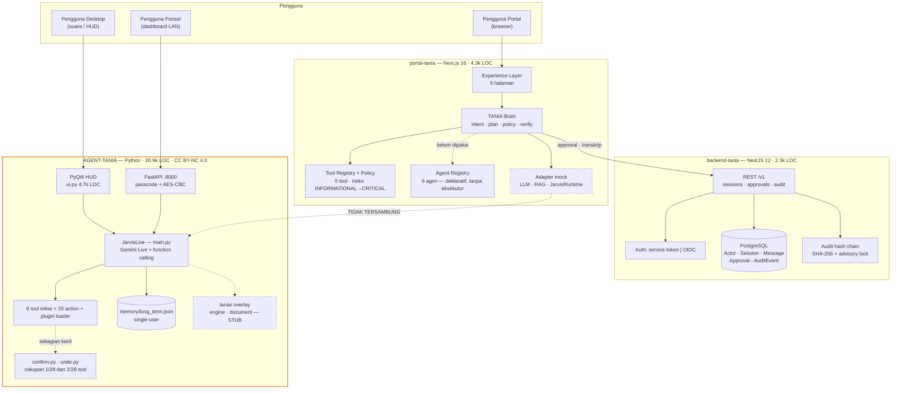

> **ARSIP — jangan dipakai sebagai keadaan sekarang.**
> Dokumen ini adalah versi 1.0, menggambarkan repositori **sebelum** fondasi monorepo dikerjakan.
> Keadaan terkini ada di [`../current-state.md`](../current-state.md) dan [`../gap-analysis.md`](../gap-analysis.md).

# TANIA — Current State Architecture

| Item | Keterangan |
|---|---|
| Versi dokumen | 1.0 |
| Tanggal audit | 19 September 2026 |
| Lingkup | Seluruh isi direktori `TANIA/` (3 komponen kode, 2 dokumen produk, aset brand) |
| Metode | Inspeksi statis penuh: struktur direktori, pembacaan modul inti, hitung LOC, status git, inventaris tes & konfigurasi deployment |
| Status | Deskriptif — **tidak ada kode yang diubah** selama audit ini |

> **Catatan pasca-audit (19 September 2026).** Fase 1 (fondasi rekayasa) telah
> dikerjakan: `portal-tania/` kini `apps/web/`, `backend-tania/` kini `apps/api/`,
> dan tiga paket bersama ditambahkan di `packages/`. Isi dokumen ini tetap
> menggambarkan keadaan **sebelum** perubahan tersebut; hasilnya didokumentasikan
> di [`foundation.md`](../foundation.md).

Dokumen terkait: [`tania-target-architecture.md`](../tania-target-architecture.md) · [`gap-analysis.md`](../gap-analysis.md)

---

## 1. Ringkasan Eksekutif

Repositori berisi **tiga basis kode yang berjalan dan tidak saling terhubung**, dikembangkan pada waktu dan dengan asumsi produk yang berbeda:

1. **AGENT-TANIA** (±20.900 LOC Python) — asisten desktop suara/visi berbasis Gemini Live, turunan dari proyek Mark-LIII. Inilah kandidat *JARVIS Runtime*.
2. **portal-tania** (±4.300 LOC TypeScript) — Portal + TANIA Brain: Next.js, tool registry, policy layer, evidence & execution trace.
3. **backend-tania** (±2.300 LOC TypeScript) — NestJS + Prisma + PostgreSQL: persistensi sesi, approval gate, audit trail berantai hash.

Dua di antaranya (portal, backend) sudah saling terintegrasi dan teruji end-to-end. AGENT-TANIA **belum tersambung sama sekali** — di portal ia masih diwakili adapter mock.

Temuan paling menentukan bukan teknis, melainkan **definisi produk**: repositori memuat dua definisi TANIA yang berbeda dan saling bertentangan (lihat §7). Keputusan atas hal ini menentukan hampir semua keputusan arsitektur berikutnya.

---

## 2. Peta Repositori

```
TANIA/
├── Claude.md                    # Development Constitution (AI Employee)
├── PRD-TANIA.md                 # PRD v1.2 (Talent & Analytics) — definisi produk berbeda
├── README.md                    # Mengikuti PRD, bukan Constitution
├── Avatar TANIA.png             # Brand board avatar
├── Model Avatar TANIA.png       # Brand board avatar (varian)
├── Portal TANIA.png             # Mockup portal
├── AGENT-TANIA/                 # Python — runtime desktop (repo git terpisah)
├── portal-tania/                # Next.js — Portal + TANIA Brain (tidak ter-version-control)
├── backend-tania/               # NestJS + Prisma — persistensi & tata kelola (tidak ter-version-control)
└── .kilo/                       # Artefak tooling
```

### Volume kode

| Komponen | Bahasa | Berkas | LOC | Tes | Status |
|---|---|---|---:|---:|---|
| AGENT-TANIA | Python 3 | 50 `.py` | 20.939 | **0** | Berjalan, matang, tanpa tes |
| portal-tania | TypeScript/React | 64 `.ts/.tsx` | 4.321 | 31 | Berjalan, build bersih |
| backend-tania | TypeScript/NestJS | 41 `.ts` | 2.260 | 54 (38 unit + 16 e2e) | Berjalan, build bersih |

---

## 3. Inventaris per Kategori

| Kategori | Ada di mana | Keadaan |
|---|---|---|
| **Frontend** | `apps/web` (Next.js 16, React 19, Tailwind v4, 9 halaman) · `AGENT-TANIA/ui.py` (PyQt6 HUD, 4.687 LOC) · `AGENT-TANIA/dashboard/static` (HTML dashboard ponsel) | Tiga UI terpisah, tiga paradigma |
| **Backend** | `apps/api` (NestJS 12, 5 modul domain) · `AGENT-TANIA/dashboard/server.py` (FastAPI, 794 LOC) | Dua backend dengan tujuan berbeda |
| **Database** | PostgreSQL via Prisma 7 (`apps/api`, 5 model) | Hanya di backend. JARVIS memakai berkas JSON |
| **Authentication** | `apps/api`: service token + OIDC verifier (JWKS, `jose`) · `apps/web`: `MockIdentityProvider` · `AGENT-TANIA`: passcode + AES-CBC + bearer token di `sessionStorage` | Tiga skema berbeda, tidak ada SSO |
| **AI modules** | `apps/web/src/lib/tania/{brain,llm,rag,intent}` (abstraksi + mock) · `AGENT-TANIA/main.py` (Gemini Live), `core/llm_client.py` (Ollama/OpenAI-compatible), `tania/intelligence/gemini_multimodal.py` | Dua jalur LLM independen |
| **Existing agents** | `apps/web/src/lib/tania/agents/registry.ts` (6 agen, deklaratif) · PRD §6.8 AV-07 (roadmap 12 agen) | Registry ada, **eksekutornya belum ada** |
| **Tools** | `apps/web` tool registry (5 tool, berisiko-berlabel) · `AGENT-TANIA` 8 tool inline + 20 action file + plugin loader | Dua registry terpisah, tidak sinkron |
| **JARVIS modules** | `AGENT-TANIA/core/*` (11 modul: action_loader, plugin_loader, confirm, undo, llm_client, stt, tts, wake_word, audio_devices, installer) | Matang dan terdokumentasi baik |
| **Memory** | `AGENT-TANIA/memory/memory_manager.py` → `memory/long_term.json` (single-user) · `config_manager.py` → `config/api_keys.json` | Tidak ada memori di portal/backend |
| **Dashboards** | Portal `/dashboard` + `/analytics` (data contoh) · JARVIS HUD (PyQt6) · JARVIS remote dashboard (FastAPI:8000) | Tiga dashboard, tak ada data bersama |
| **Tests** | portal 31 · backend 54 (termasuk e2e pada PostgreSQL asli) · AGENT-TANIA **0** | 21k LOC tanpa jaring pengaman |
| **Deployment config** | **Tidak ada** — tanpa Dockerfile, compose, CI workflow, IaC, atau manifest lingkungan | Seluruh repo |

---

## 4. AGENT-TANIA — JARVIS Runtime

Repo git tersendiri (`github.com/begawansemar7-pixel/AGENT-TANIA`, branch `tania/customization`).

**Arsitektur runtime.** `main.py` (1.744 LOC) berisi kelas `JarvisLive`: sesi Gemini Live (`models/gemini-3.1-flash-live-preview`) dengan function calling, loop audio masuk/keluar, wake word, vision (screen/camera), dan dispatch tool di `_execute_tool`.

**Model tool.** Tiga lapis, semuanya bermuara ke nama unik:

| Lapis | Sumber | Jumlah | Mekanisme |
|---|---|---:|---|
| Inline | `main.py` `TOOL_DECLARATIONS` | 8 | `system_status`, `screen_process`, `close_camera`, `manage_monitor`, `shutdown_jarvis`, `save_memory`, `recall_memory`, `undo` |
| Action | `actions/*.py` | 20 | `core/action_loader.py` — auto-discovery berkas ber-`TOOL` dict, validasi skema, deteksi tabrakan nama, dispatch lewat introspeksi signature |
| Plugin | `plugins/*.py` | 0 aktif | `core/plugin_loader.py` — sama, plus toggle enable/disable dari config |

`action_loader.py` adalah pola terbaik di repositori ini: tool mendeskripsikan dirinya sendiri di berkasnya, core tidak pernah meng-hardcode cabang dispatch, dan kegagalan import tidak pernah menjatuhkan proses.

**Tata kelola lokal.**
- `core/confirm.py` — gate konfirmasi yang **tidak bisa dipalsukan model**: token dikeluarkan antarmuka (HUD), bukan parameter tool; non-blocking; timeout 90 detik. Desainnya tepat.
- `core/undo.py` — jurnal aksi reversibel (stack 10), model memanggil `undo`.
- **Cakupan nyata sangat sempit**: `confirm` dipakai **1 dari 28 tool** (`computer_settings`), `push_undo` oleh **2** (`computer_settings`, `file_controller`). Tool destruktif lain — kendali berkas, browser, mouse/keyboard, kirim pesan — berjalan tanpa gate maupun undo.

**Memori & konfigurasi.** `memory/long_term.json` (kategori→kunci→nilai, batas prompt terpisah dari batas penyimpanan — desain bagus). Kunci Gemini tersimpan **plaintext** di `config/api_keys.json`.

**Dashboard jarak jauh.** FastAPI pada port 8000, HTTP polos dengan enkripsi lapisan aplikasi (AES-256-CBC berkunci session key), token bearer di `sessionStorage`, pairing lewat QR, SSL opsional bila sertifikat tersedia. Cocok untuk LAN pribadi, **bukan** untuk identitas enterprise.

**Lapisan `tania/`.** Ditambahkan sebagai "overlay" arsitektur: `tania/core/engine.py` (facade OBSERVE→…→REPORT), `tania/document/{agent,models}.py`, `tania/intelligence/gemini_multimodal.py`. Semuanya **stub pass-through** — kontrak tanpa implementasi. `docs/MIGRATION-MAP.md` memetakan niat migrasi Mark-LIII → TANIA.

**Lisensi.** `TANIA-LICENSE-NOTICE.md` menyatakan turunan dari Mark-LIII berlisensi **CC BY-NC 4.0 — penggunaan komersial tidak diizinkan**.

---

## 5. portal-tania — Portal & TANIA Brain

Next.js 16 (App Router) + React 19 + TypeScript strict + Tailwind v4.

- **Experience**: 9 halaman sesuai mockup (Home, Dashboard, My Work, TANIA Workspace, Knowledge, AI Agents, Documents, Analytics, Settings).
- **Brain** (`src/lib/tania/brain.ts`): UNDERSTAND → PLAN → POLICY → KNOW → ACT → VERIFY → AUDIT; menghasilkan jawaban + evidence + execution trace; tidak pernah mengekspos chain-of-thought.
- **Abstraksi**: `LlmProvider`, `KnowledgeRetriever`, `JarvisRuntime`, `ApprovalStore`, `TranscriptStore`, `IdentityProvider` — semua di-inject dari composition root `container.ts`.
- **Tool registry & policy**: 5 tool berlabel risiko `INFORMATIONAL`→`CRITICAL`, dicek terhadap scope aktor (least privilege); ambang approval dari environment.
- **Agents**: 6 definisi agen spesialis (domain, tahap kapabilitas, tool yang diizinkan, batas risiko) — **deklaratif, belum dieksekusi**.
- **Retrieval**: korpus benih 7 dokumen, penyaringan clearance dilakukan **sebelum** skoring.
- **Implementasi nyata**: LLM, retriever, dan runtime JARVIS semuanya **mock** deterministik.

## 6. backend-tania — Persistensi & Tata Kelola

NestJS 12 + Prisma 7 + PostgreSQL.

- **Model data**: `Actor`, `Session`, `Message`, `Approval`, `AuditEvent`.
- **Audit berantai hash**: setiap baris menyimpan `prevHash` + `hash` (SHA-256 atas JSON kanonik), append diserialisasi `pg_advisory_xact_lock`; `GET /v1/audit/verify` merekomputasi seluruh rantai. `AuditEvent` sengaja tanpa foreign key agar cascade tidak pernah menulis ulang baris audit.
- **Approval state machine**: update bersyarat `status = PENDING` (dua approver bersamaan → `409`), cek scope `workflow:approve`, separation of duty opsional, pencatatan hasil eksekusi runtime.
- **Autentikasi**: `AUTH_MODE=service` (token first-party + assertion aktor) atau `AUTH_MODE=oidc` (verifikasi JWT via JWKS dengan discovery standar).
- **Tes**: 38 unit + 16 e2e terhadap PostgreSQL asli, termasuk deteksi baris audit yang dirusak.

---

## 7. Konflik Definisi Produk

| | PRD-TANIA.md v1.2 + README.md | Claude.md (Constitution) + kode yang dibangun |
|---|---|---|
| Nama | Talent & Analytics Intelligence Assistant | Telkom AI Native Intelligent Assistant / AI Employee |
| Inti produk | Portal talent, workload, timesheet, feasibility, budget | Asisten AI dengan Brain, agen, runtime, tata kelola |
| Stack data | Supabase (Postgres, Auth, Storage, pgvector), Vercel | PostgreSQL + Prisma + NestJS + Redis |
| Identitas | Supabase Auth, invite-only, magic link | OIDC / Microsoft Entra ID |
| AI | Avatar TANIA: tool calling ke API internal + RAG pgvector | TANIA Brain + Agent Orchestrator + JARVIS |
| Agen | Roadmap 12 agen spesialis (AV-07) | 6 agen terdaftar di registry |
| Status | "MVP live (invite-only)" di `tania-portal.vercel.app` | Tidak ada jejak kode MVP tersebut di repositori ini |
| Model data | 18 entitas bisnis (talent, timesheet, budget, …) | 5 entitas tata kelola (actor, session, message, approval, audit) |

Keduanya konsisten secara internal, tetapi **tidak ada satu pun entitas bisnis PRD yang terimplementasi** di repositori ini, dan portal yang dibangun mengikuti Constitution. Portal Vercel yang disebut PRD tidak berada dalam repositori.

---

## 8. Version Control & Hygiene

| Fakta | Implikasi |
|---|---|
| Git root efektif adalah **home directory** pengguna, dengan `.gitignore` berisi `/*` | `portal-tania/` dan `backend-tania/` **tidak ter-version-control sama sekali** |
| `AGENT-TANIA/` adalah repo git terpisah dengan remote GitHub sendiri | Tiga komponen, satu repo, tak ada riwayat bersama |
| `AGENT-TANIA/.kilo/worktrees/metal-tarascosaurus/` memuat **salinan penuh** pohon AGENT-TANIA (detached HEAD) | Duplikasi ±60 berkas; risiko menyunting salinan yang salah |
| Tidak ada CI, Dockerfile, compose, IaC, atau manifest lingkungan | Tidak ada jalur rilis yang dapat diulang |
| `.env` lokal berisi token dev pada backend | Gitignored, tetapi belum ada manajemen rahasia |

---

## 9. Diagram Keadaan Saat Ini



---

## 10. Ringkasan Temuan

**Yang sudah kuat**
1. Tata kelola enterprise di portal + backend: policy layer, approval gate persisten, audit berantai hash, evidence & trace, tes e2e pada database asli.
2. Pola tool self-describing (`action_loader.py`) dan gate konfirmasi tak-terpalsukan (`confirm.py`) di JARVIS — keduanya layak jadi acuan lintas komponen.
3. Batas antarmuka yang bersih di portal (6 antarmuka, satu composition root) sehingga adapter nyata dapat menggantikan mock tanpa menyentuh Brain.

**Yang menghambat**
1. Dua definisi produk yang bertentangan; model data bisnis PRD belum ada sama sekali.
2. Lisensi upstream non-komersial pada komponen runtime.
3. Portal ↔ JARVIS belum tersambung; Agent Orchestrator belum ada eksekutornya.
4. Nol tes dan nol konfigurasi deployment pada 21k LOC runtime.
5. Identitas terfragmentasi tiga skema; kunci API tersimpan plaintext.
