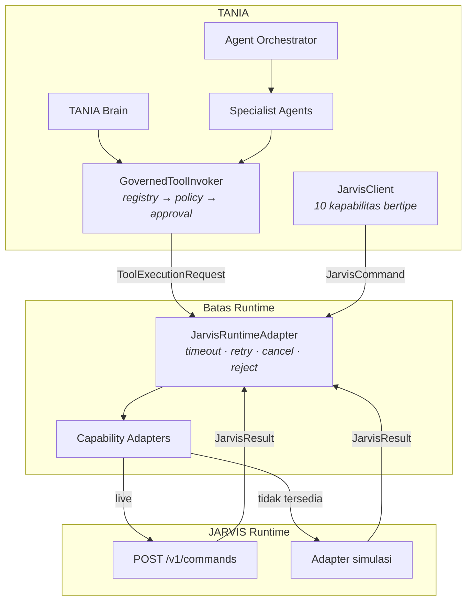

# TANIA — Integrasi JARVIS Runtime

| Item | Keterangan |
|---|---|
| Versi dokumen | 1.0 |
| Tanggal | 19 September 2026 |
| Status | **Terimplementasi** — 345 test hijau (46 di antaranya untuk batas JARVIS), diverifikasi end-to-end terhadap runtime tiruan melalui HTTP |
| Lingkup | `JarvisRuntime`, `JarvisRuntimeAdapter`, 10 adapter kapabilitas, resiliensi, dan jalur Intent → Plan → Runtime → Verification |
| Dasar | Prinsip P1 dan P2 pada [`tania-target-architecture.md`](tania-target-architecture.md) |

Dokumen terkait: [`orchestrator.md`](orchestrator.md) · [`agents.md`](agents.md) · [`foundation.md`](foundation.md)

---

## 1. Batas yang Menentukan Desain

**JARVIS tidak ditulis ulang, dan kemampuannya tidak diduplikasi.** TANIA memutuskan *apa* yang harus terjadi dan *apakah boleh*; JARVIS memutuskan *bagaimana* dan mengerjakannya.

Konsekuensi konkretnya pada kode:

- Tidak ada satu pun baris di TANIA yang membuka browser, membaca berkas, atau menjalankan workflow. Yang ada hanyalah **perintah terstruktur** yang dikirim keluar.
- Kontrak di `packages/types/src/runtime.ts` tidak menyebut satu pun detail internal JARVIS.
- Kapabilitas yang tidak tersedia **disimulasikan secara eksplisit**, bukan dikarang. Setiap adapter simulasi melaporkan `live: false`.

---

## 2. Dua Bentuk, Satu Pintu



| Pintu | Untuk siapa | Bentuk |
|---|---|---|
| `runtime.execute()` / `compensate()` | Brain, agen, orkestrator | `ToolExecutionRequest` → dipetakan ke perintah `tools.invoke` |
| `JarvisClient` | Pemanggil yang butuh kapabilitas di luar tool | Metode bertipe per kapabilitas |

Keduanya berakhir sebagai `JarvisCommand` pada `JarvisRuntimeAdapter`. Itulah sebabnya timeout, retry, pembatalan, dan penolakan berlaku seragam — tidak ada jalan pintas ke runtime.

---

## 3. Perintah dan Hasil

TANIA mengirim:

```jsonc
{
  "requestId": "…",              // kunci idempotensi; retry memakai ulang
  "capability": "tools",
  "action": "tools.invoke",
  "task": "Menjalankan Workflow Execution",
  "parameters": { "toolId": "workflow.execute", "…": "…" },
  "risk": "HIGH",
  "requiresApproval": true,
  "approvalId": "…",             // keputusan manusia yang tercatat
  "correlationId": "…", "sessionId": "…", "taskId": "…", "actorId": "…",
  "timeoutMs": 30000
}
```

JARVIS menjawab:

```jsonc
{
  "status": "SUCCEEDED",         // | FAILED | TIMEOUT | CANCELLED | UNSUPPORTED | REJECTED
  "evidence": [ /* Evidence[] — sumber yang dapat dikutip */ ],
  "artifacts": [ /* berkas, tangkapan layar, klip */ ],
  "executionTime": 7,
  "error": { "code": "…", "message": "…", "retryable": false },
  "summary": "…"
}
```

`risk` dan `requiresApproval` ikut dikirim dengan sengaja: runtime adalah tempat terakhir yang masih bisa menolak, dan ia tidak boleh perlu menebak dari nama aksi apakah ada manusia yang menyetujui.

---

## 4. Sepuluh Kapabilitas

| Kapabilitas | Aksi | Adapter simulasi melakukan |
|---|---|---|
| `voice.input` | `voice.transcribe` | Mengembalikan transkrip yang diberikan; menyatakan ia tidak mendengarkan apa pun |
| `voice.output` | `voice.speak` | Menyiapkan artefak teks; tidak ada audio yang diputar |
| `vision` | `vision.describe` | Mencatat rujukan gambar **tanpa** mendeskripsikan isinya |
| `browser` | `browser.open`, `browser.read` | Memvalidasi URL; tidak memuat halaman |
| `computer` | `computer.control` | **Menolak** (`UNSUPPORTED`) |
| `files` | `files.read/write/list` | Penyimpanan dalam memori |
| `tools` | `tools.invoke`, `tools.compensate` | Menjalankan tool dari registry secara simulasi |
| `skills` | `skills.list`, `skills.run` | Dua skill placeholder |
| `session` | `session.open/close/status` | Status sesi runtime |
| `verification` | `verification.check` | Memeriksa **catatan** eksekusi saja (`scope: record-only`) |

Tiga adapter sengaja menolak berpura-pura:

- **`vision`** tidak mendeskripsikan gambar yang tidak pernah dilihatnya.
- **`browser`** tidak mengarang isi halaman.
- **`computer`** menolak sama sekali. Ini satu-satunya kapabilitas yang kesalahannya tidak dapat diperbaiki dengan mengulang; sukses simulasi di sini akan melatih pemanggil menganggapnya tidak berbahaya.

### Menyatakan apa yang benar-benar dilayani

`JARVIS_CAPABILITIES` (dipisah koma) menyatakan kapabilitas mana yang benar-benar dilayani runtime terkonfigurasi. Yang tidak disebut tetap simulasi. Kosong berarti "semuanya".

```bash
TANIA_RUNTIME_ADAPTER=jarvis
JARVIS_BASE_URL=https://jarvis.internal
JARVIS_CAPABILITIES=tools,files     # sisanya tetap simulasi
```

Nama yang tidak dikenal menggagalkan pemuatan konfigurasi, bukan diabaikan diam-diam: operator yang tidak sadar salah ketik akan mengira kapabilitasnya aktif.

`GET /api/tania/runtime` dan halaman Settings menampilkan mana yang live dan mana yang simulasi, per kapabilitas.

---

## 5. Timeout, Retry, Pembatalan, Kegagalan

Keempatnya dimiliki `CapabilityRoutingAdapter`, bukan masing-masing adapter — supaya "setiap kapabilitas gagal dengan cara yang sama" menjadi sifat yang dapat diandalkan logika pemulihan orkestrator.

| Perilaku | Aturan |
|---|---|
| **Timeout** | Anggaran diambil dari opsi panggilan → `command.timeoutMs` → default 30 detik. Lewat batas → `TIMEOUT`, dan panggilan di bawahnya **di-abort**, tidak dibiarkan berjalan |
| **Retry** | Hanya bila runtime sendiri menandai `retryable: true`, atau statusnya `TIMEOUT`. `REJECTED`, `UNSUPPORTED`, dan kegagalan permanen tidak pernah diulang |
| **Pembatalan** | Sinyal yang sudah abort → tidak ada perintah dikirim sama sekali. Abort di tengah jalan → `CANCELLED`, dan retry berhenti |
| **Kegagalan** | Tidak ada yang dilempar ke pemanggil. Adapter yang melempar menjadi `ADAPTER_ERROR`; pemanggil selalu menerima `JarvisResult` |

Satu keputusan yang layak disebut: **pekerjaan yang terlanjur selesai sebelum pembatalan sampai tetap dilaporkan `SUCCEEDED`.** Menyebutnya `CANCELLED` akan menyembunyikan perubahan yang sudah terjadi di sistem enterprise, dan tidak ada yang akan mengompensasinya.

---

## 6. Persetujuan di Ujung Runtime

Gerbang persetujuan sudah dijaga policy layer dan orkestrator. Runtime adapter menambah lapisan terakhir:

> Perintah dengan `requiresApproval: true` tetapi tanpa `approvalId` dikembalikan sebagai `REJECTED` **sebelum** menyentuh adapter kapabilitas mana pun.

Nilai `requiresApproval` berasal dari policy layer — yang tahu ambang terkonfigurasi — dengan default aturan konstitusi (L3/L4 selalu perlu). Jadi pemanggil yang melewati tata kelola tetap tidak bisa menjalankan aksi berisiko tinggi.

---

## 7. Alur Penuh

```
Permintaan pengguna
  → Intent          (IntentService)
  → Plan            (AgentRouter + CapabilityPlanner, risiko L0–L4)
  → [Approval]      (L3/L4 diparkir sampai manusia memutuskan)
  → JarvisRuntimeAdapter   (JarvisCommand; timeout, retry, cancel, reject)
  → JARVIS                 (adapter HTTP live, atau adapter simulasi)
  → Result                 (status, evidence, artifacts, executionTime, error)
  → Verification           (invarian tata kelola pada apa yang benar-benar berjalan)
  → TANIA Response         (status, aksi, tool, bukti, hasil, error)
```

`evidence` dan `artifacts` dari runtime naik ke laporan tugas seperti sumber lain, sehingga jawaban yang bersandar pada hasil eksekusi tetap dapat dikutip.

---

## 8. Yang Harus Disediakan Sebuah Deployment JARVIS

Ini **kontrak yang diucapkan TANIA**, bukan API yang ditemukan pada suatu deployment. Integrasi dilakukan dengan menyediakan satu endpoint:

```
POST {JARVIS_BASE_URL}/v1/commands
Content-Type: application/json
Body:     JarvisCommand
Response: JarvisResult   (boleh dibungkus { data: … })
```

Aturan transport:

| Kondisi | Perlakuan TANIA |
|---|---|
| Koneksi gagal | `RUNTIME_UNREACHABLE`, **retryable** |
| `5xx` | `RUNTIME_<status>`, **retryable** |
| `4xx` | `RUNTIME_<status>`, tidak diulang |
| Bukan JSON / tanpa `status` | `RUNTIME_BAD_RESPONSE`, tidak diulang |

Respons yang tidak berbentuk `JarvisResult` ditolak, bukan diteruskan: jejak eksekusi tidak boleh memuat status yang dikarang TANIA.

---

## 9. Diverifikasi di Stack Nyata

Dijalankan terhadap runtime JARVIS tiruan yang benar-benar melayani `POST /v1/commands`:

| Yang diuji | Hasil |
|---|---|
| Tugas L1 lewat HTTP | `COMPLETED`; dua perintah `tools.invoke` (`enterprise.data`, `analytics.query`) sampai ke runtime |
| Bukti dari runtime | `evidence` JARVIS ikut terkutip di laporan tugas |
| Gerbang L3 | Nol perintah sampai ke runtime sebelum manusia memutuskan |
| Sesudah disetujui | Perintah membawa `risk: HIGH`, `requiresApproval: true`, dan `approvalId` yang benar |
| `JARVIS_CAPABILITIES=tools,files` | Portal melaporkan 2 dari 10 live; delapan sisanya dinamai sebagai simulasi |

---

## 10. Pengujian

| Berkas | Isi |
|---|---|
| `apps/web/tests/jarvis-runtime.test.ts` | 19 test: bentuk amplop, routing kapabilitas, timeout (termasuk abort yang benar-benar terjadi), retry, pembatalan, penolakan persetujuan, adapter yang melempar |
| `apps/web/tests/jarvis-capabilities.test.ts` | 19 test: kesepuluh kapabilitas simulasi, transport HTTP, dan deklarasi kapabilitas |
| `apps/web/tests/jarvis-integration.test.ts` | 8 test: Intent → Plan → Adapter → JARVIS → Result → Verification, termasuk jalur Brain dan gerbang L3 |

---

## 11. Batasan yang Diketahui

1. **Tidak ada JARVIS nyata di lingkungan ini.** Kesepuluh kapabilitas berjalan pada adapter simulasi kecuali `JARVIS_BASE_URL` diarahkan ke runtime yang menghormati kontrak di §8. Verifikasi §9 memakai runtime tiruan, bukan JARVIS produksi.
2. **Autentikasi ke JARVIS belum ada.** `HttpCapabilityAdapter` menerima header tambahan, tetapi tidak ada kredensial yang diasumsikan atau dikarang. Skema token JARVIS yang sebenarnya harus ditambahkan saat diketahui.
3. **Satu endpoint untuk semua kapabilitas.** Bila JARVIS memisahkan endpoint per kapabilitas, `path` per adapter sudah dapat dikonfigurasi, tetapi belum ada env untuk itu.
4. **Artefak dirujuk, tidak disalin.** TANIA mencatat `uri` dan metadata; belum ada pengambilan atau penyimpanan artefak besar.
5. **Verifikasi runtime bersifat record-only.** Adapter simulasi memeriksa konsistensi catatan eksekusi, bukan keadaan sistem enterprise.
