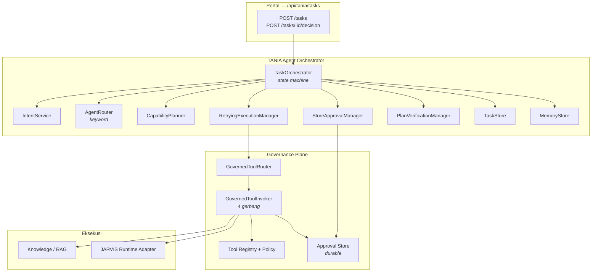

# TANIA — Agent Orchestrator

| Item | Keterangan |
|---|---|
| Versi dokumen | 1.0 |
| Tanggal | 19 September 2026 |
| Status | **Terimplementasi** — 299 test hijau (44 di antaranya untuk siklus hidup tugas dan pemulihan kegagalan), diverifikasi end-to-end di atas PostgreSQL |
| Lingkup | `Orchestrator`, `Planner`, `AgentRouter`, `ToolRouter`, `ExecutionManager`, `VerificationManager`, `ApprovalManager` |
| Dasar | Prinsip P1, P2, P5, dan P8 pada [`tania-target-architecture.md`](tania-target-architecture.md) |

Dokumen terkait: [`agents.md`](agents.md) · [`rag.md`](rag.md) · [`foundation.md`](foundation.md)

---

## 1. Apa yang Ditambahkan Lapisan Ini

Sebelum orkestrator, satu permintaan menghasilkan satu jawaban. Sesudahnya, satu permintaan menghasilkan **tugas**: objek berumur panjang yang punya status, rencana, bukti, verifikasi, dan riwayat yang dapat diaudit — dan yang dapat **berhenti di tengah jalan** menunggu keputusan manusia lalu dilanjutkan.

Perbedaan itu penting karena aksi berisiko tinggi tidak boleh terjadi dalam satu putaran permintaan HTTP. Aksi L3/L4 harus bisa menunggu manusia, dan tugas yang gagal setelah separuh berjalan harus bisa **dibatalkan kembali**, bukan ditinggalkan setengah jadi.

---

## 2. Siklus Hidup

```
REQUESTED → UNDERSTANDING → PLANNING ─┬─→ EXECUTING → VERIFYING ─┐
                                      │        ↑                  │
                                      └→ APPROVAL ┘               │
                                                                  ↓
            COMPLETED | FAILED | BLOCKED | CANCELLED ← REMEMBERING ← REPORTING
```

Tabel transisi ada di `packages/tania/src/orchestration/index.ts` (`TASK_TRANSITIONS`). Dua invarian dijaga di sana, bukan di konvensi:

1. **Setiap akhir dilaporkan dan diingat.** Tidak ada satu pun status yang boleh langsung melompat ke status terminal — hanya `REMEMBERING` yang bisa. Tugas yang gagal, diblokir, atau dibatalkan tetap melewati `REPORTING` dan `REMEMBERING`.
2. **Status terminal benar-benar akhir.** `COMPLETED`, `FAILED`, `BLOCKED`, dan `CANCELLED` tidak punya transisi keluar.

Setiap perpindahan melewati `canTransition()`. Perpindahan yang tidak ada di tabel melempar `TaniaError.internal` — lebih baik berisik daripada meninggalkan tugas dalam keadaan mustahil.

> **Catatan urutan.** Spesifikasi awal menulis `… → COMPLETED/FAILED/BLOCKED/CANCELLED → REPORTING → REMEMBERING`. Implementasi **menentukan** hasil akhir pada titik yang sama (segera setelah eksekusi atau keputusan manusia selesai) tetapi **menerapkannya** paling akhir, sesudah laporan tersusun dan memori ditulis. Alasannya satu: sebuah tugas tidak boleh berstatus `COMPLETED` sebelum hasilnya benar-benar ada. Dengan begitu `COMPLETED` tetap berarti "selesai dan dapat dibaca", bukan "sedang menyusun laporan".

### Status yang dilihat pemanggil

| Status | Arti |
|---|---|
| `REQUESTED` | Tugas dibuat |
| `UNDERSTANDING` | Intent sedang ditentukan |
| `PLANNING` | Agen dipilih, rencana disusun dari tool yang dideklarasikannya |
| `APPROVAL` | Ada aksi L3/L4 — tugas diparkir, **belum ada yang berjalan** |
| `EXECUTING` | Rencana dijalankan lewat tool terkendali |
| `VERIFYING` | Hasil dicocokkan dengan yang dijanjikan |
| `REPORTING` | Hasil akhir disusun |
| `REMEMBERING` | Kesimpulan ditulis ke memori |
| `COMPLETED` / `FAILED` / `BLOCKED` / `CANCELLED` | Akhir |

---

## 3. Komponen



| Komponen | Berkas | Tanggung jawab |
|---|---|---|
| `TaskOrchestrator` | `apps/web/src/lib/orchestration/orchestrator.ts` | Menggerakkan siklus hidup; satu-satunya yang memindahkan status |
| `CapabilityPlanner` | `planner.ts` | Menyusun rencana **hanya** dari `requiredTools` agen yang dirutekan |
| `KeywordAgentRouter` | `../agents/router.ts` | Memilih agen spesialis (dipakai ulang, tidak diduplikasi) |
| `GovernedToolRouter` | `tool-router.ts` | Mengikat aksi ke pemanggilan tool yang diizinkan, plus rollback bila ada |
| `RetryingExecutionManager` | `execution-manager.ts` | Menjalankan rencana, mengulang kegagalan sesaat, mengompensasi aksi yang sudah berjalan |
| `PlanVerificationManager` | `verification-manager.ts` | Memeriksa apakah yang terjadi cocok dengan yang dijanjikan |
| `StoreApprovalManager` | `approval-manager.ts` | Gerbang keputusan manusia untuk L3/L4 |
| `InMemoryTaskStore` | `task-store.ts` | Catatan tugas per pemilik (salinan masuk dan keluar) |
| `InMemoryMemoryStore` | `memory-store.ts` | Tahap `REMEMBERING`, sadar klasifikasi saat dibaca |

Semuanya disuntikkan lewat `createOrchestrationStack()` di `orchestration/index.ts` dan dirangkai sekali di `tania/container.ts`. Orkestrator memakai **agen, approval store, runtime, dan retriever yang sama** dengan jalur percakapan: satu bidang tata kelola, dua pintu masuk.

---

## 4. Model Risiko

| Kode | Level | Contoh tool | Perlakuan |
|---|---|---|---|
| **L0** | `INFORMATIONAL` | `knowledge.search` | Berjalan langsung |
| **L1** | `LOW` | `analytics.query`, `enterprise.data` | Berjalan langsung |
| **L2** | `MEDIUM` | `document.draft` | Berjalan langsung, dapat dikompensasi |
| **L3** | `HIGH` | `workflow.execute` | **Wajib persetujuan manusia** |
| **L4** | `CRITICAL` | `system.broadcast` | **Wajib persetujuan manusia** |

`requiresHumanApproval()` di `@tania/types` adalah satu-satunya sumber kebenaran untuk aturan L3/L4. Permintaan juga boleh menurunkan pagu lewat `maxRisk`: aksi di atas pagu direncanakan sebagai `BLOCKED` dengan alasan yang terbaca, **bukan** dibuang diam-diam.

Hanya `agent.automation` yang mendeklarasikan tool `HIGH`, sehingga hanya rencananya yang sampai ke gerbang. Itu disengaja: kemampuan L3 adalah milik satu agen yang jelas pemiliknya, bukan sesuatu yang tersebar.

### Jalur persetujuan

1. Rencana berisi aksi L3/L4 → orkestrator membuat gerbang di approval store **durable** (PostgreSQL lewat backend NestJS), memarkir tugas di `APPROVAL`, dan mengembalikan `pendingApprovalId`. Runtime belum disentuh sama sekali.
2. Manusia memutuskan lewat `POST /api/approvals` — keputusan itu masuk ke jejak audit berantai.
3. Rute persetujuan mencari tugas pemilik gerbang lewat `TaskStore.findByApproval()`. Bila ada, keputusan dicatat lalu **orkestrator** yang melanjutkan tugas; Brain tidak ikut mengeksekusi. Tanpa pencarian ini, satu aksi akan berjalan dua kali: sekali oleh jalur percakapan dan sekali saat tugas dilanjutkan.
4. `POST /api/tania/tasks/:id/decision` dengan `{"decision":"resume"}` juga melanjutkan tugas. Persetujuan yang sudah diberikan **dibaca ulang dari store** dan hanya dihormati bila `status === 'APPROVED'` dan `toolId` cocok — endpoint ini tidak bisa dipakai menjalankan aksi yang tidak pernah disetujui.
5. Ditolak atau kedaluwarsa → tugas berakhir `BLOCKED` dengan error `APPROVAL_DENIED`.

Sebuah tugas selalu melekat pada **sesi**: rute `POST /api/tania/tasks` memastikan sesi itu ada sebelum tugas dimulai, karena approval dan audit di backend bergantung padanya.

---

## 5. Pemulihan Kegagalan

| Kejadian | Perilaku |
|---|---|
| Kegagalan sesaat | Diulang sampai `maxAttempts` dengan backoff; percobaan tercatat di jejak, tidak disembunyikan |
| Kegagalan permanen | Tugas `FAILED`; langkah berikutnya tidak dijalankan |
| Kegagalan setelah ada perubahan | Aksi **reversible** yang sudah sukses dikompensasi dari yang terbaru; statusnya menjadi `COMPENSATED` |
| Aksi tidak reversible | Dibiarkan apa adanya — orkestrator tidak berpura-pura membatalkan apa yang tidak bisa dibatalkan |
| Ditolak kebijakan | Aksi `BLOCKED`, aksi lain yang diizinkan tetap berjalan; bila semua diblokir, tugas `BLOCKED` |
| Pembatalan di tengah jalan | Kompensasi dijalankan lebih dulu, lalu tugas `CANCELLED` |
| Verifikasi gagal | Tugas `FAILED` meski semua tool sukses — misalnya jawaban berbasis pengetahuan tanpa satu pun sitasi |

Kompensasi hanya dijanjikan bila runtime benar-benar mendukungnya: `GovernedToolRouter.bind()` memasang `compensate()` hanya jika tool `reversible` **dan** adapter runtime mengimplementasikan `compensate()`.

---

## 6. Yang Boleh Dilihat Pemanggil

`TaskReport` adalah **seluruh** permukaan publik sebuah tugas:

```jsonc
{
  "taskId": "…",
  "sessionId": "…",
  "question": "Analisa performance product X.",
  "intent": "ANALYZE",
  "status": "COMPLETED",
  "plan":    [ { "id", "label", "toolId", "agentId", "risk", "riskCode",
                 "status", "reversible", "attempts?", "approvalId?", "detail?" } ],
  "agents":  ["agent.performance"],
  "tools":   [ { "toolId", "name", "risk", "status", "summary" } ],
  "evidence":[ { "id", "title", "source", "snippet", "classification", … } ],
  "verification": { "ok": true, "issues": [], "checkedAt": "…" },
  "result":  "Tugas selesai: 3 aksi dijalankan. 1 sumber dikutip sebagai dasar.",
  "errors":  [],
  "trace":   [ { "id", "label", "stage", "status", "toolId?", "detail?", "durationMs?" } ],
  "risk": "LOW", "riskCode": "L1",
  "createdAt": "…", "updatedAt": "…",
  "pendingApprovalId": "…"
}
```

**Penalaran tersembunyi tidak dimodelkan sama sekali** — tidak ada medan untuknya, sehingga tidak ada yang bisa bocor. Yang terpapar hanya: status berjalan, aksi yang direncanakan, tool yang dipakai, bukti, hasil, dan error. Dua test menjaganya: satu mencocokkan setiap kunci laporan dengan daftar yang diizinkan, satu lagi memastikan laporan yang diserialisasi tidak memuat kata seperti `reasoning`, `thought`, atau `prompt`.

---

## 7. Endpoint

| Metode | Path | Fungsi |
|---|---|---|
| `POST` | `/api/tania/tasks` | Memulai tugas; mengembalikan jejak eksekusi penuh |
| `GET` | `/api/tania/tasks?limit=` | Daftar tugas milik aktor, terbaru dulu |
| `GET` | `/api/tania/tasks/:id` | Membaca kembali satu tugas |
| `POST` | `/api/tania/tasks/:id/decision` | `{"decision":"resume"}` atau `{"decision":"cancel","reason":"…"}` |

Semua endpoint memerlukan aktor terautentikasi, memvalidasi payload di batas API, dan memakai amplop respons `{ data, requestId, meta? }` yang sama dengan rute lain. Tugas milik aktor lain tidak dapat dibaca maupun diubah — store memfilter berdasarkan pemilik, bukan berdasarkan tebakan.

---

## 8. Contoh: "Analisa performance product X."

| Tahap | Yang terjadi |
|---|---|
| `UNDERSTANDING` | Intent `ANALYZE` |
| `PLANNING` | `agent.performance` (confidence 0.80); rencana: `enterprise.data` (L1), `knowledge.search` (L0), `analytics.query` (L1) |
| — | Tidak ada L3/L4 → tanpa gerbang |
| `EXECUTING` | Tiga aksi lewat `GovernedToolInvoker` |
| `VERIFYING` | Tool sesuai deklarasi ✓ · tanpa aksi tak bergerbang ✓ · ada sitasi ✓ |
| `REPORTING` | "Tugas selesai: 3 aksi dijalankan. 1 sumber dikutip sebagai dasar." |
| `REMEMBERING` | Ditulis ke memori dengan kunci `task.<taskId>` |
| `COMPLETED` | Risiko tertinggi rencana: **L1** |

### Diverifikasi di stack nyata

Dijalankan terhadap PostgreSQL + backend NestJS + portal Next.js:

| Permintaan | Hasil |
|---|---|
| "Analisa performance product X." | `COMPLETED` L1 · `agent.performance` · 3 aksi · **0 sumber** → hasil menyatakan terus terang bahwa tidak ada dasar pengetahuan |
| "Bagaimana kinerja delivery kuartal ini?" | `COMPLETED` L1 · 3 sumber dikutip |
| "Jalankan workflow onboarding partner baru." | `APPROVAL` L3 · `agent.automation` · `tools: []` — **tidak ada yang berjalan** · lanjut tanpa persetujuan ditolak · setelah disetujui: `COMPLETED`, `workflow.execute` berjalan **sekali** |
| Gerbang yang sama, ditolak | `BLOCKED` · error `APPROVAL_DENIED` |
| Tugas yang diparkir, dibatalkan | `CANCELLED` |
| Rantai audit backend | `ok: true`, 43 peristiwa terverifikasi |

---

## 9. Pengujian

| Berkas | Isi |
|---|---|
| `apps/web/tests/task-lifecycle.test.ts` | 17 test: kelengkapan tabel transisi, status terminal tanpa jalan keluar, akhir hanya dari `REMEMBERING`, corong `REPORTING`, urutan tahap jalur normal, bentuk jejak eksekusi, isolasi antar aktor, pagu risiko, dan **permukaan laporan** |
| `apps/web/tests/task-recovery.test.ts` | 27 test: retry sesaat, kegagalan permanen, kompensasi, aksi tak reversible, blokir kebijakan, gerbang persetujuan (parkir, menunggu, disetujui, ditolak, dijalankan tepat sekali), pencarian tanpa hasil, verifikasi tata kelola, pembatalan, dan perpindahan mustahil yang harus melempar |
| `apps/web/tests/helpers/task-harness.ts` | Runtime terskrip, agen uji, dan pembaca urutan status dari jejak |

---

## 10. Batasan yang Diketahui

1. **`InMemoryTaskStore`.** Tugas tidak bertahan melewati restart proses. Approval-nya **sudah** durable (PostgreSQL lewat backend NestJS), jadi yang hilang adalah rekaman tugas, bukan keputusan manusia. Adapter durable menggantinya tanpa menyentuh orkestrator.
2. **`InMemoryMemoryStore`.** Sama — tahap `REMEMBERING` jujur tetapi belum permanen.
3. **Kompensasi bergantung runtime.** `MockJarvisRuntime` selalu berhasil membatalkan. Adapter JARVIS nyata harus melaporkan kegagalan kompensasi, dan orkestrator perlu menandai tugas yang kompensasinya gagal sebagai butuh perhatian manusia.
4. **Eksekusi berurutan.** Rencana dijalankan satu per satu. Belum ada langkah paralel maupun percabangan bersyarat.
5. **Belum ada UI tugas.** Endpoint sudah ada; panel "My Work" belum menampilkan tugas panjang beserta gerbangnya.
