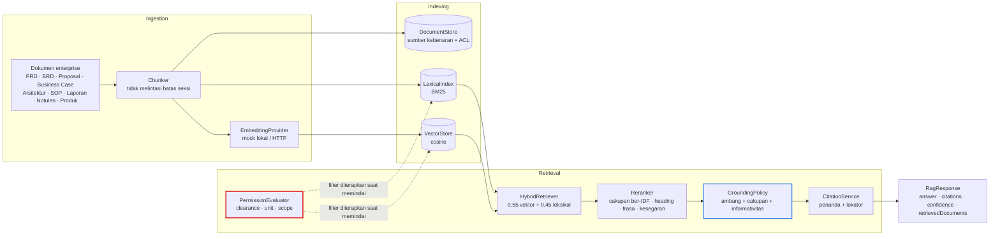

# TANIA — Knowledge & RAG Architecture

| Item | Keterangan |
|---|---|
| Versi dokumen | **1.1** |
| Tanggal | 19 September 2026 |
| Status | **Terimplementasi** — evaluasi RAG, kontrak retrieval, batas HTTP, dan sitasi di UI semuanya tertutup tes |
| Lingkup | Ingestion, indexing, retrieval, reranking, citations, permissions |
| Dasar | Prinsip P3 dan P6 pada [`tania-target-architecture.md`](tania-target-architecture.md) |

Dokumen terkait: [`foundation.md`](foundation.md) · [`gap-analysis.md`](gap-analysis.md)

---

## 1. Dua Janji yang Dipegang Lapisan Ini

1. **Pengguna tidak pernah menerima dokumen yang tidak boleh ia akses.** Penyaringan izin terjadi **sebelum** skoring, di dalam indeks. Dokumen yang tidak terlihat tidak pernah di-ranking, tidak masuk prompt, tidak muncul sebagai sitasi, dan tidak terhitung pada `retrievedDocuments`.
2. **Tidak ada klaim tanpa sumber.** Bila retrieval tidak melewati ambang grounding, model **tidak dipanggil sama sekali**; jawabannya menyatakan secara eksplisit bahwa rujukannya tidak ada.

---

## 2. Pipeline



---

## 3. Abstraksi

Semua port ada di [`@tania/core/knowledge`](../../packages/tania/src/knowledge/index.ts); implementasinya di `apps/web/src/lib/knowledge/`.

| Port | Implementasi saat ini | Pengganti produksi |
|---|---|---|
| `DocumentStore` | `InMemoryDocumentStore` | PostgreSQL / object storage |
| `EmbeddingProvider` | `MockEmbeddingProvider` (hash lokal), `HttpEmbeddingProvider` (OpenAI-compatible) | Gateway embedding enterprise |
| `VectorStore` | `InMemoryVectorStore` | pgvector / vector DB |
| `Retriever` | `HybridRetriever` (vektor + BM25) | Sama, dengan indeks nyata |
| `Reranker` | `LexicalReranker` | Cross-encoder |
| `CitationService` | `MarkerCitationService` | Sama |
| `PermissionEvaluator` | `ClearanceAndAclEvaluator` | Sama, sumber ACL dari IdP/IAM |
| `KnowledgeIngestor` | `IngestionService` | Pipeline batch + webhook |

Pemilihan adapter embedding mengikuti pola yang sama dengan LLM: eksternal dipakai **hanya** bila `TANIA_RAG_BASE_URL` dan `TANIA_RAG_API_KEY` lengkap; bila tidak, embedding lokal dipakai dan alasannya dicatat di log.

---

## 4. Model Izin

`DocumentAcl` bersifat konjungtif — ketiganya harus lolos:

| Aturan | Arti | Contoh penolakan |
|---|---|---|
| `classification` | Clearance aktor harus mencapai klasifikasi dokumen | `INTERNAL` tidak dapat membaca `CONFIDENTIAL` |
| `units` | Bila diisi, unit organisasi aktor harus termasuk | Auditor ber-clearance `RESTRICTED` tetap ditolak pada dokumen milik People & Culture |
| `scopes` | Bila diisi, aktor harus memegang salah satu scope | SOP runtime hanya untuk pemegang `workflow:run` |

Dua hal yang membuat janji ini nyata, bukan sekadar niat:

- **Predikat izin diberikan ke indeks**, bukan diterapkan setelahnya. `VectorStore.query` dan `LexicalIndex.search` memanggilnya saat memindai kandidat.
- **Pengindeks melihat semua dokumen** (aktor sistem ber-clearance `RESTRICTED`), sedangkan penyaringan terjadi per-kueri terhadap aktor yang bertanya. Alternatifnya — mengindeks per tingkat clearance — akan menghapus materi begitu seseorang berakses sempit memicu rebuild.

---

## 5. Grounding dan Confidence

Jawaban hanya boleh menegaskan sesuatu bila **tiga** syarat terpenuhi:

| Syarat | Alasan |
|---|---|
| Skor tertinggi ≥ `TANIA_RAG_MIN_SCORE` (default 0,18) | Kecocokan terbaik tetap bisa buruk |
| Cakupan istilah ber-IDF ≥ 0,2 | Skor saja tidak membuktikan pertanyaan dibahas; kata umum tidak boleh membuka grounding |
| Informativitas pertanyaan | Pertanyaan yang seluruhnya tersusun dari kata umum korpus menahan keyakinan |

`confidence.score` = `(0,6 · skor ternormalisasi + 0,2 · margin + 0,2 · kesepakatan dokumen) × informativitas`, dipetakan ke `HIGH ≥ 0,7`, `MEDIUM ≥ 0,45`, selebihnya `LOW`; `NONE` berarti tidak ter-ground.

Ketika tidak ter-ground, `RagService.answer` **tidak memanggil model** dan mengembalikan `NO_SOURCE_ANSWER` dengan `citations: []`.

---

## 6. Sitasi

Setiap sitasi membawa apa yang dibutuhkan pembaca untuk memverifikasi sendiri:

```jsonc
{
  "marker": 1,
  "documentId": "doc.sop-approval",
  "title": "SOP — Persetujuan Aksi Berisiko Tinggi",
  "locator": "Kewenangan · hlm. 1",
  "snippet": "Keputusan atas aksi berisiko HIGH diberikan oleh pemegang scope workflow:approve…",
  "classification": "INTERNAL",
  "score": 0.89
}
```

Dua penjaga tambahan:

- `CitationService.verify` memastikan id yang dikutip benar-benar ada pada hasil retrieval.
- `enforceCitationMarkers` menghapus penanda `[n]` yang tidak punya sumber — penanda kosong adalah klaim tanpa dasar yang menyamar sebagai sitasi.

Di UI, sitasi tampil bernomor beserta lokator, ditambah badge keyakinan dan daftar **dokumen ditelusuri** (termasuk yang tidak dikutip), sehingga pembaca melihat dasar jawaban maupun apa yang dipertimbangkan lalu ditolak.

---

## 7. Kontrak RAG

```ts
interface RagResponse {
  answer: string;
  citations: Citation[];          // kosong bila tidak ter-ground
  confidence: Confidence;         // score, level, rationale
  retrievedDocuments: RetrievedDocument[];  // termasuk yang tidak dikutip
}
```

Dipakai oleh:

- `POST /api/tania/knowledge/search` — mengembalikan kontrak ini apa adanya.
- `POST /api/tania/chat` — `citations` menjadi `sources`, `confidence` dan `retrievedDocuments` masuk ke `status`.

---

## 8. Evaluasi

`tests/knowledge-evaluation.test.ts` menjalankan fixture di `lib/knowledge/evaluation/fixtures.ts`:

| Kelompok | Yang diuji | Kasus |
|---|---|---|
| Relevant retrieval | Pertanyaan mendarat pada dokumen yang benar, peringkat teratas tepat | 6 |
| Irrelevant retrieval | Pertanyaan di luar korpus **tidak** ter-ground dan tidak menghasilkan sitasi | 4 |
| Permission filtering | Empat aktor berbeda clearance/unit/scope tidak pernah melihat materi terlarang | 7 |
| Citation correctness | Sitasi hanya menunjuk materi yang diambil, lokator dan klasifikasinya cocok dengan dokumen asli, penanda berurutan | 4 |
| Hallucination resistance | Tanpa rujukan → menolak menjawab; setiap angka pada jawaban harus ada pada kutipan | 3 |
| Batas yang diketahui | Perilaku lemah yang sengaja dikunci (lihat §9) | 2 |

---

## 8b. Penyaringan per Jenis Dokumen

Sembilan jenis dideklarasikan di `DOCUMENT_KINDS`, dan ketersembilannya hadir di
korpus benih — dijaga sebuah tes, karena jenis yang dideklarasikan tetapi tidak
pernah ada di korpus tidak diuji oleh suite mana pun: tidak ada yang
mengambilnya, jadi tidak ada yang memeriksa izin atau sitasinya.

| Jenis | Contoh di korpus |
|---|---|
| `PRD` · `BRD` · `PROPOSAL` · `BUSINESS_CASE` | Dokumen produk dan komersial |
| `ARCHITECTURE` · `SOP` | Keputusan teknis dan prosedur |
| `REPORT` · `MEETING_MINUTES` · `PRODUCT_DOC` | Laporan, notulen, katalog produk |

Pemanggil dapat mempersempit pencarian: `kinds: ['SOP']` pada `RetrievalQuery`
atau pada `POST /api/tania/knowledge/search`.

> **Cacat yang ditemukan saat menulis tesnya.** `RetrievalRequest` — kontrak
> yang diterima *Retriever* — sudah membawa `kinds` sejak awal, dan
> `HybridRetriever` menerapkannya dengan benar. Tetapi `RetrievalQuery` —
> kontrak yang diterima *RagService*, yang dilalui **setiap** pemanggil — tidak
> memilikinya. Filternya terimplementasi, teruji satu lapis di bawah, dan tidak
> dapat dijangkau dari mana pun di aplikasi.
>
> Kelas cacat yang sama dengan `sweep()` pada pembatas laju: ditulis, benar, dan
> tidak pernah tersambung. Kini diteruskan, dan lima tes gagal bila
> penerusannya dicabut.

Jenis yang tidak dikenal **ditolak**, bukan diabaikan: menjatuhkannya diam-diam
akan melebarkan pencarian kembali ke seluruh korpus — kebalikan dari yang
diminta pemanggil.

---

## 8c. Sitasi di Antarmuka

`EvidenceList` merender setiap sitasi dengan penanda, judul, *locator*
(bagian dan halaman), klasifikasi, dan sumbernya — cukup bagi pembaca untuk
membuka dokumennya dan memeriksa kalimatnya sendiri.

Dua sifat dijaga tes, karena keduanya diam-diam merusak kepercayaan bila salah:

1. **Penanda tetap bersama dokumennya.** Jawaban yang merujuk `[2]` sementara
   daftar menampilkan dokumen lain di posisi itu terlihat terverifikasi padahal
   tidak — lebih buruk daripada jawaban tanpa sitasi.
2. **Ketiadaan sitasi dinyatakan.** Jawaban tanpa rujukan menampilkan pesan
   eksplisit, bukan daftar kosong yang mudah terbaca sebagai "sudah diperiksa".

---

## 8d. Batas HTTP

`POST /api/tania/knowledge/search` mengembalikan kontrak RAG apa adanya, dan
enam belas tes menahannya di sana. Yang paling penting:

| Yang dijaga | Mengapa |
|---|---|
| `classificationCeiling` **tidak pernah dapat melebarkan** | Nilainya datang dari badan permintaan. `visibilityFilter` memeriksa `canRead(actor, …)` lebih dulu dan tanpa syarat, lalu ceiling menjadi filter *tambahan*. Tukar urutan keduanya dan klien dapat menyebut clearance-nya sendiri |
| `retrievedDocuments` tidak pernah memuat dokumen di atas clearance | Daftar itu berisi yang *dipertimbangkan*. Bila penyaringan terjadi setelah perangkingan, dokumen terlarang akan muncul lewat judulnya saja — pengungkapan tanpa satu pun sitasi |
| Jenis tak dikenal ditolak | Lihat §8b |

---

## 9. Batasan yang Diketahui

1. **Embedding lokal bersifat leksikal, bukan semantis.** `MockEmbeddingProvider` memproyeksikan bag-of-words ter-hash, jadi kemiripan kosinus mendekati tumpang tindih kata. Konsekuensinya nyata dan sudah dikunci oleh tes: pertanyaan tentang *band kompensasi* dapat menjangkau SOP runtime yang memakai kata "kompensasi" dalam arti berbeda. Jaminan yang penting tetap berlaku — dokumen gaji yang `RESTRICTED` tidak pernah terlihat, keyakinan tidak `HIGH`, dan sitasi yang ditampilkan membuat ketidakcocokan itu kasatmata bagi pembaca. Mengganti embedding dengan model nyata seharusnya membuat tes itu gagal; itulah sinyal untuk memperketatnya.
2. **Stemming dangkal.** Hanya sufiks `-nya`, `-kan`, `-an`, `-i` yang dipotong. Ini menutup jurang "tenggatnya" vs "tenggat", tetapi bukan pengganti stemmer Bahasa Indonesia.
3. **Indeks in-memory.** Seluruh korpus diindeks ulang saat proses dingin; belum ada persistensi indeks maupun ingestion inkremental dari sumber nyata.
4. **Belum ada parsing berkas.** Korpus ditulis sebagai data terstruktur; PDF/DOCX/PPTX belum di-parse — kontrak `KnowledgeIngestor` sudah menyediakan tempatnya.
5. **Reranker leksikal.** Belum ada cross-encoder; peringkat kedua memakai sinyal cakupan, heading, frasa, dan kesegaran.

---

## 10. Konfigurasi

| Variabel | Default | Fungsi |
|---|---|---|
| `TANIA_RAG_PROVIDER` | `mock` | `external` mengaktifkan adapter embedding HTTP |
| `TANIA_RAG_BASE_URL` | — | Base URL API embeddings |
| `TANIA_RAG_API_KEY` | — | Kredensial (ditandai rahasia, tidak pernah ditampilkan) |
| `TANIA_RAG_EMBEDDING_MODEL` | `tania-hash-embed-v1` | Nama model embedding |
| `TANIA_RAG_EMBEDDING_DIMENSIONS` | `128` | Dimensi vektor |
| `TANIA_RAG_TOP_K` | `3` | Jumlah passage yang dikutip |
| `TANIA_RAG_MIN_SCORE` | `18` | Ambang grounding dalam persen |

---

## 11. Langkah Lanjutan

1. Ganti `MockEmbeddingProvider` dengan model nyata, lalu perketat tes batasan pada §9.
2. Pindahkan `InMemoryVectorStore` ke pgvector, gunakan skema Prisma yang sudah ada.
3. Tambahkan parsing berkas (PDF/DOCX/PPTX) di belakang `KnowledgeIngestor`.
4. Ambil ACL dari IAM/IdP, bukan dari korpus statis.
5. Tambahkan cross-encoder reranker dan ukur ulang fixture evaluasi sebagai baseline regresi.
