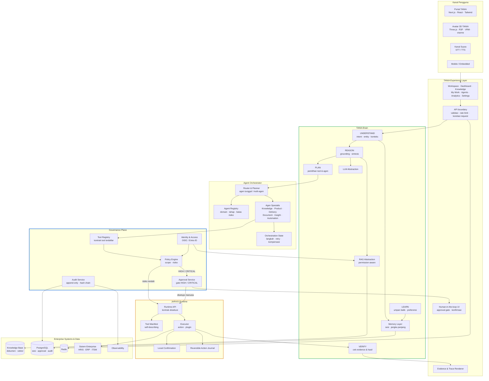
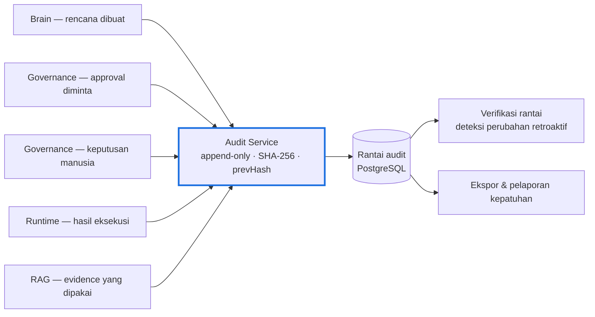
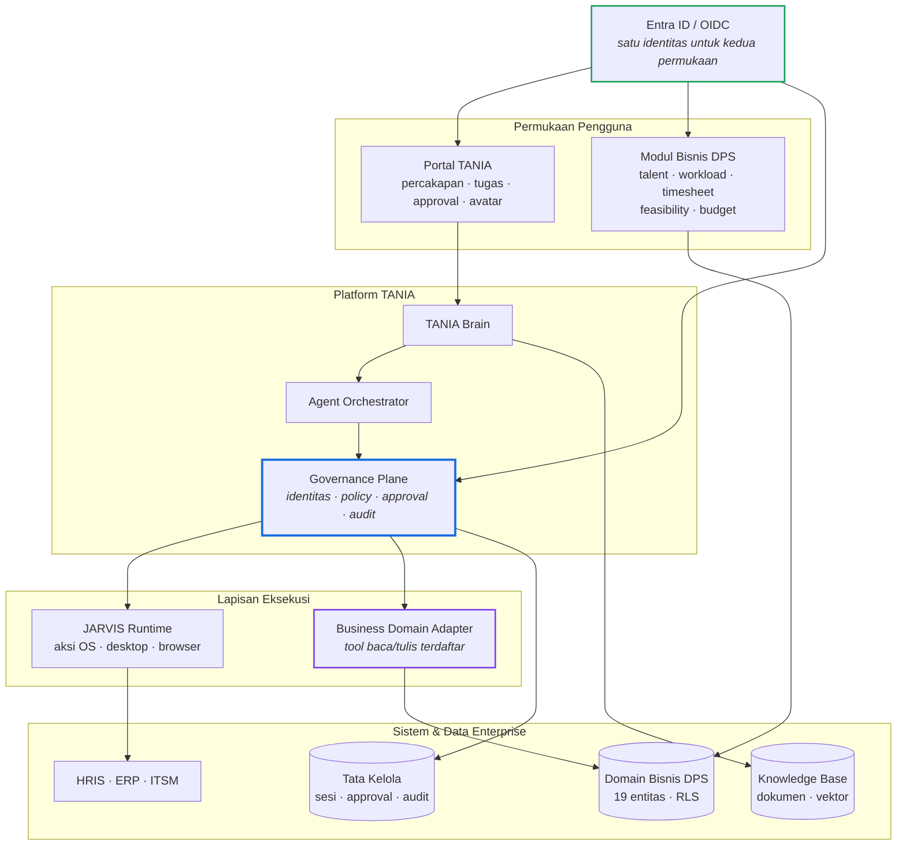
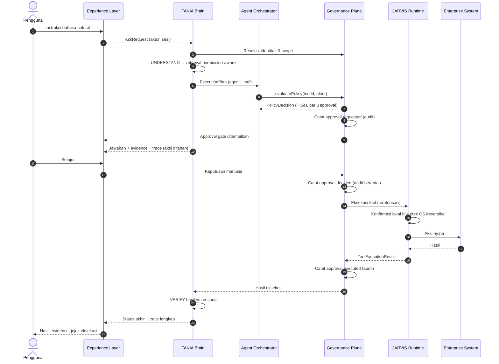
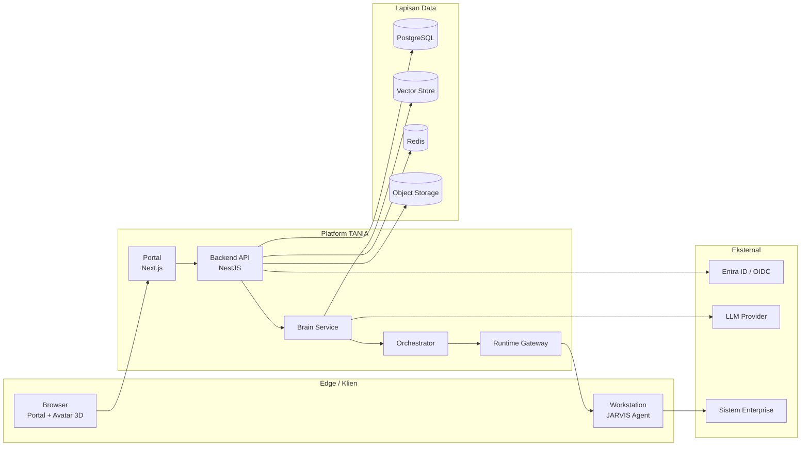

# TANIA — Target Architecture

| Item | Keterangan |
|---|---|
| Versi dokumen | **2.0** |
| Tanggal | 19 September 2026 |
| Sumber acuan | `Claude.md` (TANIA Development Constitution) |
| Sifat | Preskriptif — sasaran arsitektur, bukan laporan keadaan |
| Status implementasi | Lihat [`gap-analysis.md`](gap-analysis.md); dokumen ini **tidak** mendeskripsikan apa yang sudah ada |
| Perubahan v2.0 | Prinsip, kontrak, model risiko, dan invarian **tidak berubah** — semuanya terbukti bertahan. Yang ditambahkan: lapisan Domain Bisnis (§2.3), pemetaan status implementasi (§7), dan keputusan permukaan produk (§9) |

Dokumen terkait: [`current-state.md`](current-state.md) · [`gap-analysis.md`](gap-analysis.md)

---

## 1. Prinsip Arsitektur

Diturunkan langsung dari Constitution, diurutkan menurut kekuatan mengikatnya.

| # | Prinsip | Konsekuensi arsitektural |
|---|---|---|
| P1 | TANIA adalah lapisan **intelijen/orkestrasi**; JARVIS adalah lapisan **eksekusi** | Brain tidak pernah memanggil sistem enterprise langsung |
| P2 | Jangan menduplikasi kapabilitas JARVIS yang sudah ada | Tool desktop/OS tetap milik runtime, dibungkus kontrak, bukan ditulis ulang |
| P3 | Data enterprise **permission-aware** | Penyaringan hak akses terjadi sebelum retrieval, bukan sesudah |
| P4 | Aksi berisiko tinggi wajib **persetujuan manusia** | Gate persetujuan adalah komponen, bukan konvensi |
| P5 | Setiap aksi bermakna menghasilkan **jejak audit** | Audit append-only, dapat diverifikasi, tak dapat disangkal |
| P6 | Jawaban berbasis pengetahuan enterprise wajib menyertakan **evidence** | Retrieval dan sitasi bagian dari kontrak jawaban |
| P7 | **Tidak pernah** mengekspos chain-of-thought | Yang keluar hanya status eksekusi aman, evidence, tool, hasil akhir |
| P8 | LLM tidak boleh mengeksekusi perintah sistem arbitrer | Semua eksekusi lewat tool registry + policy layer |
| P9 | Modular: frontend, backend, brain, runtime, agen, tata kelola terpisah | Tidak ada layanan AI monolitik |
| P10 | Setiap integrasi yang belum tersedia diwakili **adapter + mock** | Tidak ada API, kredensial, atau tabel yang direka-reka |

---

## 2. Diagram Arsitektur Target

### 2.1 Lapisan dan alur utama



Jalur wajib yang dikunci diagram ini: **tidak ada panah langsung** dari Brain atau agen ke Enterprise Systems. Setiap eksekusi melewati Tool Registry → Policy Engine → (Approval bila perlu) → JARVIS Runtime.

### 2.2 Fan-in audit

Audit bukan cabang samping melainkan titik temu: lima produsen peristiwa menulis ke satu rantai yang dapat diverifikasi.



### 2.3 Domain Bisnis sebagai sistem enterprise pertama

Audit v2.0 menemukan bahwa domain bisnis DPS (talent, workload, timesheet, feasibility, budget) **sudah terimplementasi** di `tania-portal`. Arsitektur sasaran tidak memperlakukannya sebagai modul di dalam Brain, melainkan sebagai **sistem enterprise** — persis seperti HRIS atau ERP — yang dijangkau lewat jalur yang sama dengan sistem lain.

Itu menjaga P1 dan P9: Brain tetap lapisan intelijen, domain bisnis tetap sistem sumber, dan tidak ada layanan AI monolitik yang menelan keduanya.



Tiga konsekuensi yang mengikat:

1. **Domain bisnis dijangkau lewat tool terdaftar**, bukan lewat query langsung dari Brain. Tool `talent.search`, `timesheet.read`, `budget.reallocate` masing-masing membawa `effect`, `reversible`, `defaultRisk`, dan `requiredScopes` seperti tool lain. Realokasi anggaran adalah `HIGH` dan melewati gerbang approval; membaca profil talent adalah `LOW`.
2. **Satu identitas, dua permukaan.** Kedua portal mengonsumsi klaim dari IdP yang sama. Tanpa ini, audit TANIA menunjuk aktor yang berbeda dari aktor yang menulis baris bisnis.
3. **RLS domain bisnis tetap berlaku** dan tidak digantikan policy engine TANIA. Keduanya berlapis: policy engine memutuskan apakah aksi boleh direncanakan, RLS memutuskan baris mana yang boleh disentuh. Kegagalan salah satu tetap menghentikan aksi.

---

## 3. Tanggung Jawab & Kontrak per Lapisan

| Lapisan | Milik | Kontrak keluar | Tidak boleh |
|---|---|---|---|
| **Experience** | Rendering, interaksi, HITL, sitasi & trace | `AskRequest` / `AskResponse` | Logika bisnis, akses data langsung |
| **Brain** | Intent, grounding, rencana, verifikasi, memori | `ExecutionPlan`, `AskResponse` | Memanggil sistem enterprise; menyimpan rahasia |
| **Agent Orchestrator** | Routing agen, urutan langkah, retry/kompensasi | `AgentTask`, `AgentResult` | Memakai tool di luar registry |
| **Governance Plane** | Identitas, scope, risiko, approval, audit | `PolicyDecision`, `ApprovalRequest`, `AuditEvent` | Mengeksekusi aksi |
| **JARVIS Runtime** | Eksekusi tool, konfirmasi lokal, undo | `ToolManifest`, `ToolExecutionResult` | Menentukan kebijakan risiko enterprise |
| **Enterprise Systems** | Data & sistem sumber | API/adapter masing-masing | Diakses tanpa melewati runtime |

### Kontrak inti

```
ToolManifest        : { toolId, name, description, parameters, effect,
                        reversible, defaultRisk, requiredScopes }
PolicyDecision      : { allowed, requiresApproval, reason, riskLevel }
ApprovalRequest     : { id, sessionId, toolId, action, risk, reason,
                        requestedBy, status, decidedBy, decidedAt }
ToolExecutionResult : { status, summary, durationMs, output?, error?,
                        compensation? }
AuditEvent          : { sequence, occurredAt, event, actorId, sessionId,
                        approvalId, risk, payload, prevHash, hash }
Evidence            : { id, title, source, snippet, classification,
                        updatedAt, score, url? }
TraceStep           : { id, label, stage, status, toolId?, durationMs?, detail? }
```

`ToolManifest` adalah satu-satunya sumber kebenaran kapabilitas runtime: JARVIS menerbitkannya, Governance Plane mengklasifikasikan risikonya, Brain merencanakan di atasnya. Tool yang tidak ada di manifest tidak dapat direncanakan maupun dieksekusi.

---

## 4. Tingkat Risiko & Gate

| Tingkat | Definisi | Perlakuan target |
|---|---|---|
| `INFORMATIONAL` | Membaca pengetahuan, tanpa efek samping | Otomatis; dicatat |
| `LOW` | Membaca data operasional terkurasi | Otomatis; dicatat |
| `MEDIUM` | Membuat artefak privat, reversibel | Otomatis + entri jurnal undo |
| `HIGH` | Mengubah state enterprise, sulit dibatalkan | **Approval manusia** + audit + kompensasi |
| `CRITICAL` | Ireversibel / berdampak luas | **Approval manusia** + separation of duty + audit |

Aturan yang tidak dapat dinegosiasikan:
1. Klasifikasi risiko ditentukan **Governance Plane**, bukan model, bukan parameter tool.
2. Gate `HIGH`/`CRITICAL` gagal-tertutup: bila approval tidak dapat dipersistenkan, aksi **tidak dijalankan**.
3. Konfirmasi lokal JARVIS adalah lapisan kedua untuk efek OS, bukan pengganti approval enterprise.

---

## 5. Alur Aksi Berisiko Tinggi



---

## 6. Topologi Penyebaran Target



Catatan penyebaran: `Runtime Gateway` adalah satu-satunya jalan masuk ke agen JARVIS; agen tidak menerima koneksi masuk dari internet dan melakukan koneksi keluar terautentikasi ke gateway.

---

## 7. Pemetaan Teknologi

Status diverifikasi 19 September 2026 dengan menjalankan typecheck, 576 unit test, dan 19 e2e di repositori ini.

| Lapisan | Teknologi target (Constitution) | Status | Catatan |
|---|---|:--:|---|
| Frontend | Next.js, React, TypeScript, Tailwind | ✅ | Next.js 16, React 19, Tailwind v4, TS strict — 10 halaman |
| Avatar | Three.js, React Three Fiber, GLB/VRM, blendshapes, viseme lip sync | 🟡 | Seluruh pipeline ada dan teruji; **aset masih fikstur** 2,4 KB |
| Backend | NestJS, Prisma, PostgreSQL, Redis | 🟡 | NestJS 12 + Prisma 7 + PostgreSQL berjalan; **Redis disediakan compose tetapi belum dipakai kode** |
| Identitas | OIDC / Microsoft Entra ID | 🟡 | `OidcTokenVerifier` backend siap & teruji; **portal masih `MockIdentityProvider`** |
| AI — abstraksi | LLM, RAG, Agent, Tool | ✅ | Empat abstraksi lengkap dengan port terinjeksi |
| AI — implementasi | Provider nyata di balik abstraksi | ❌ | LLM, retrieval eksternal, dan embedding semuanya mock |
| Orkestrasi | Agent Orchestrator, state langkah, kompensasi | ✅ | 12 status, tabel transisi tertutup, retry & kompensasi |
| Runtime | JARVIS adapter | 🟡 | Sisi TANIA lengkap (10 kapabilitas, timeout/retry/cancel); **sisi JARVIS belum mengimplementasikan kontrak** |
| Persistensi tata kelola | PostgreSQL append-only | 🟡 | Approval & transkrip durabel; **sink audit, task, memori, indeks masih in-memory** |
| Vector store | Penyimpanan vektor nyata | ❌ | `InMemoryVectorStore` + embedding hash |
| Observability | Log terstruktur, metrik, distributed tracing | 🟡 | Log JSON ber-correlation id dan `/api/metrics` ada; **tracing & error monitoring belum** |
| Deployment | Container, CI, environment tervalidasi | 🟡 | Dockerfile multi-stage non-root, compose, CI 4 job — **tetapi tidak ada repositori git yang memicunya, dan belum ada CD** |

---

## 8. Invarian yang Harus Selalu Benar

Setiap perubahan arsitektur berikutnya diuji terhadap sepuluh pernyataan ini:

1. Tidak ada jalur eksekusi dari LLM ke sistem enterprise yang melewati Tool Registry.
2. Setiap tool yang dapat dieksekusi memiliki entri manifest dengan `effect` dan `requiredScopes`.
3. Klasifikasi risiko tidak pernah berasal dari input model.
4. Aksi `HIGH`/`CRITICAL` tidak pernah berjalan tanpa baris approval berstatus `APPROVED`.
5. Rantai audit dapat diverifikasi ulang kapan saja dan tidak pernah ditulis ulang oleh cascade.
6. Dokumen di atas clearance aktor tidak pernah masuk ke prompt maupun sitasi.
7. Jawaban berbasis pengetahuan enterprise selalu membawa evidence atau menyatakan ketiadaannya.
8. Trace hanya memuat status eksekusi aman; chain-of-thought tidak pernah disimpan atau dirender.
9. Kegagalan komponen tata kelola menghentikan aksi berisiko, bukan melewatinya.
10. Setiap integrasi yang belum tersedia hadir sebagai antarmuka + mock, bukan sebagai asumsi tersembunyi.

---

## 9. Permukaan Produk: Tiga Opsi

Audit v2.0 menemukan dua sistem yang sama-sama berjalan: platform TANIA (tata kelola AI mendalam, tanpa domain bisnis) dan `tania-portal` (domain bisnis lengkap, tanpa tata kelola AI). Arsitektur sasaran di atas dapat dicapai lewat tiga jalur. Pilihan ini **milik Product Owner**, bukan keputusan teknis — dokumen ini hanya menyatakan konsekuensi arsitektur masing-masing.

| Opsi | Bentuk | Keuntungan | Biaya | Risiko utama |
|---|---|---|---|---|
| **A — Konvergensi** | `tania-portal` menjadi modul bisnis di dalam Portal TANIA; Supabase tetap jadi sistem sumber di balik Business Domain Adapter | Satu permukaan, satu identitas, satu jejak audit; domain bisnis langsung mendapat tata kelola AI | Migrasi UI 12 halaman; pemetaan RLS ↔ scope; pengguna yang ada ikut terdampak | Pengguna nyata `tania-portal` terganggu selama transisi |
| **B — Federasi** | Dua portal tetap terpisah, disatukan oleh IdP bersama dan Business Domain Adapter | Tidak mengganggu pengguna yang ada; dapat dikerjakan bertahap | Dua permukaan yang harus dijaga konsisten; dua design system | Jejak audit terbelah bila adapter dilewati |
| **C — Pemisahan** | Dua produk berbeda, tanpa integrasi | Paling murah hari ini | Domain bisnis tidak pernah mendapat tata kelola AI; TANIA tidak pernah punya data nyata | "AI Employee" tetap tidak bisa dibuktikan di atas pekerjaan nyata |

**Rekomendasi arsitektur: Opsi B lebih dulu, dengan Opsi A sebagai sasaran.** Alasannya bukan preferensi bentuk melainkan urutan risiko: federasi menuntut satu prasyarat yang **bagaimanapun wajib** (identitas bersama, §2.3), memberi platform TANIA data nyata untuk pertama kalinya, dan tidak memaksa migrasi UI sebelum ada bukti bahwa tata kelola AI bernilai di atas pekerjaan DPS yang sesungguhnya. Konvergensi dapat diputuskan kemudian dengan informasi yang jauh lebih baik.

Apa pun yang dipilih, dua hal berlaku di ketiganya dan dapat dikerjakan sekarang: **identitas tunggal** dan **durabilitas jejak tata kelola**.
