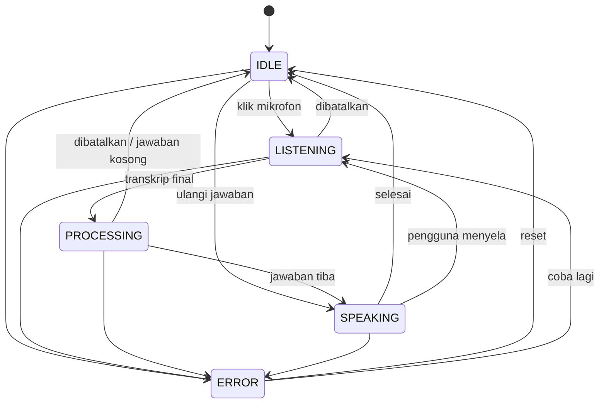

# TANIA — Interaksi Suara

| Item | Keterangan |
|---|---|
| Versi dokumen | 1.0 |
| Tanggal | 19 September 2026 |
| Status | **Terimplementasi** — 379 test hijau (34 di antaranya untuk suara), diverifikasi di peramban sungguhan |
| Lingkup | `TaniaVoiceController`, `VoiceStateMachine`, `SpeechInputAdapter`, `SpeechOutputAdapter`, seam avatar |
| Dasar | Bagian 7 (UX) dan prinsip "3D TANIA adalah lapisan antarmuka manusia" pada [`tania-target-architecture.md`](tania-target-architecture.md) |

Dokumen terkait: [`jarvis-integration.md`](jarvis-integration.md) · [`orchestrator.md`](orchestrator.md)

---

## 1. Alur

```
Mikrofon
  → JARVIS Voice Runtime (atau mesin peramban)
  → Speech-to-Text
  → TANIA Brain
  → Text-to-Speech
  → Audio
  → Avatar
```

Yang penting: **giliran suara adalah giliran biasa.** Ia melewati `send()` yang sama dengan ketikan, sehingga percakapan, panel aktivitas, dan panel hasil ikut terbarui seperti biasa. Suara mengubah cara pertanyaan tiba, bukan apa yang TANIA lakukan dengannya — termasuk tata kelola: aksi L3/L4 tetap menunggu persetujuan manusia meski dimulai dengan berbicara.

---

## 2. Lima Status



Tabel transisi ada di `packages/types/src/voice.ts`. Setiap perpindahan melewati `canTransitionVoice()`.

Dua transisi layak disorot:

- **`SPEAKING → LISTENING`** — pengguna boleh menyela jawaban dan langsung didengar. Tanpa ini, satu-satunya cara menghentikan TANIA adalah menunggu.
- **`ERROR → LISTENING`** — mikrofon yang ditolak atau timeout bisa dicoba ulang tanpa memuat ulang halaman.

Perpindahan ilegal **ditolak dan dilaporkan**, bukan diterapkan. Alasannya bukan kerapian: mikrofon yang masih merekam sementara antarmuka mengira statusnya IDLE adalah masalah privasi, bukan masalah kosmetik.

---

## 3. Komponen

| Komponen | Berkas | Tanggung jawab |
|---|---|---|
| `TaniaVoiceController` | `apps/web/src/lib/voice/controller.ts` | Urutan satu giliran; satu-satunya yang memindahkan status |
| `VoiceStateMachine` | `state-machine.ts` | Pemilik status; menjaga tabel transisi dan membersihkan detail antar giliran |
| `SpeechInputAdapter` | `input/adapter.ts` | Izin, timeout, pembatalan — seragam untuk semua mesin |
| `SpeechOutputAdapter` | `output/adapter.ts` | Pembatalan dan pemenggalan kalimat untuk jawaban yang mengalir |
| `BrowserMicrophoneAccess` | `permissions.ts` | Izin mikrofon; membedakan "ditolak" dari "tidak ada perangkat" |
| `AvatarController` | `avatar.ts` | Seam untuk avatar 3D yang belum dibangun |

Controller **tidak** mentranskrip, **tidak** menjawab, dan **tidak** menggambar. Yang dimilikinya adalah bagian yang mudah salah: bahwa mikrofon selalu tertutup saat status bilang begitu, bahwa pembatalan menjangkau setiap tahap, dan bahwa kegagalan di mana pun meninggalkan status yang bisa dipulihkan.

---

## 4. Provider

Tidak ada provider yang dipaku. Antarmuka `SpeechInputProvider` dan `SpeechOutputProvider` di `@tania/core/voice` hanya menyebut apa yang dibutuhkan satu giliran.

| Provider | Masukan | Keluaran | Catatan |
|---|---|---|---|
| **Browser** | Web Speech API | Speech Synthesis | Dipilih lebih dulu: tidak ada audio yang meninggalkan perangkat, tidak ada yang perlu dikonfigurasi. Mendukung transkrip parsial |
| **JARVIS** | `voice.transcribe` lewat `/api/tania/voice/transcribe` | `voice.speak` lewat `/api/tania/voice/speak` | Audio direkam di peramban lalu diteruskan portal; TANIA tidak mentranskrip apa pun sendiri |
| **Mock** | Deterministik | Deterministik | Untuk server rendering dan pengujian. Tidak pernah dipakai diam-diam — `providers` melaporkan mesin yang terpilih |

Pemilihan otomatis: peramban → JARVIS → mock. `prefer` memaksa salah satunya bila sebuah deployment mensyaratkannya.

---

## 5. Delapan Persyaratan

| Persyaratan | Bagaimana dipenuhi |
|---|---|
| **1. Izin mikrofon** | `BrowserMicrophoneAccess` memisahkan `query()` (tidak pernah memunculkan prompt) dari `request()` (satu-satunya yang memunculkannya). Penolakan dan ketiadaan perangkat dibedakan, karena yang satu diperbaiki di pengaturan peramban dan yang lain dengan mencolokkan sesuatu |
| **2. Status mendengarkan** | `LISTENING`, dengan transkrip parsial yang tumbuh saat mesin mendukungnya |
| **3. Status memproses** | `PROCESSING`, membawa transkrip final yang dikirim ke TANIA |
| **4. Status berbicara** | `SPEAKING`, membawa teks yang sedang diucapkan |
| **5. Pembatalan** | Satu tombol: selama apa pun berlangsung ia menjadi tombol berhenti. Pembatalan menjangkau kedua adapter apa pun statusnya — mikrofon tidak boleh tetap terbuka karena controller salah menduga tahapnya |
| **6. Penanganan kesalahan** | Setiap kegagalan provider disalurkan ke satu kosakata `VoiceError`. Kode permanen (`PERMISSION_DENIED`, `NO_MICROPHONE`, `UNSUPPORTED`) ditandai `recoverable: false` agar antarmuka tidak menawarkan percobaan ulang yang pasti gagal |
| **7. Streaming** | Transkrip parsial saat mendengarkan; saat menjawab, setiap **kalimat** yang selesai langsung diucapkan sementara sisanya masih mengalir |
| **8. Kesinambungan percakapan** | `conversationId` dari jawaban pertama dibawa ke setiap giliran berikutnya, dan `setConversation()` menyambung ke percakapan yang dimulai dengan mengetik |

### Pembatalan yang tiba terlalu cepat

Satu perilaku yang tidak jelas dari luar: menambahkan listener ke `AbortSignal` yang **sudah** dibatalkan tidak pernah memicu apa pun. Jadi pembatalan yang tiba saat prompt izin masih terbuka akan hilang, dan mikrofon akan terbuka untuk giliran yang sudah tidak ditunggu siapa pun. Setiap tahap karena itu memeriksa `signal.aborted` secara eksplisit, bukan hanya mengandalkan listener.

---

## 6. Seam Avatar

Avatar 3D belum dibangun. `AvatarController` ada sekarang supaya lapisan suara tidak menumbuhkan urusan rendering sambil menunggu:

```ts
interface AvatarController {
  cue(cue: { state: VoiceState; viseme?: string; amplitude?: number; text?: string }): void;
}
```

Controller mengirim cue untuk **setiap** perubahan status, ditambah viseme dan amplitudo dari provider keluaran. Saat controller Three.js tiba, ia mengimplementasikan antarmuka ini dan diteruskan ke `TaniaVoiceController` — tidak ada yang berubah di lapisan suara.

Sementara itu `RecordingAvatarController` menyimpan aliran cue, sehingga pengujian dan overlay debug membaca data yang persis sama dengan yang nanti dibaca avatar.

---

## 7. Diverifikasi di Peramban Sungguhan

Dijalankan lewat Chrome DevTools Protocol terhadap portal yang berjalan:

| Yang diuji | Hasil |
|---|---|
| Izin **ditolak** | Tombol menjadi "Interaksi suara bermasalah"; live region mengumumkan "Akses mikrofon ditolak…"; status tidak pernah menyentuh `LISTENING` |
| Izin **diberikan** | Tombol menjadi "Mendengarkan — klik untuk berhenti", `aria-pressed="true"` |
| **Pembatalan** | Klik kedua mengembalikan tombol ke "Mulai bicara dengan TANIA", tanpa banner kesalahan |
| **Pemulihan** | Dari `ERROR`, satu klik langsung kembali mendengarkan |
| Rute `voice.transcribe` | Runtime simulasi menolak audio tanpa mengarang kata-kata; `meta.simulated: true` |
| Rute `voice.speak` | `hasAudio: false` saat runtime tidak menghasilkan audio — bukan berpura-pura ada yang diputar |

---

## 8. Pengujian

| Berkas | Isi |
|---|---|
| `apps/web/tests/voice-state-machine.test.ts` | 13 test: kelengkapan tabel, transisi yang dilarang, penyelaan, pembersihan detail antar giliran, kesinambungan percakapan |
| `apps/web/tests/voice-controller.test.ts` | 21 test: percakapan berhasil, transkrip parsial, kesinambungan, cue avatar, streaming per kalimat, **penolakan izin**, **timeout**, **pembatalan** (termasuk yang tiba sebelum mendengarkan dimulai), kegagalan Brain, jawaban kosong |

---

## 9. Batasan yang Diketahui

1. **Avatar belum ada.** Cue diemisikan dan disimpan, tetapi belum ada yang menggambarnya. Viseme dari mesin peramban diturunkan dari batas kata, bukan dari timeline fonem sungguhan.
2. **Kapabilitas suara JARVIS masih simulasi.** `voice.transcribe` menolak audio dan `voice.speak` tidak menghasilkan audio sampai `JARVIS_BASE_URL` diarahkan ke runtime yang benar-benar melayaninya.
3. **Tidak ada barge-in otomatis.** `SPEAKING → LISTENING` sah dan diuji, tetapi penyelaan masih dipicu klik; deteksi suara saat TANIA berbicara belum ada.
4. **Bahasa tetap `id-ID`.** Locale sudah menjadi parameter di seluruh lapisan, tetapi belum ada pemilih bahasa di antarmuka.
5. **Streaming hanya pada keluaran.** Provider JARVIS mengirim audio sekali setelah pengguna berhenti bicara; transkrip parsial hanya ada pada mesin peramban.
